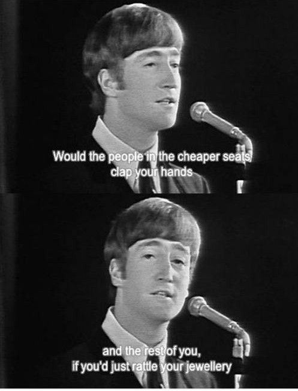
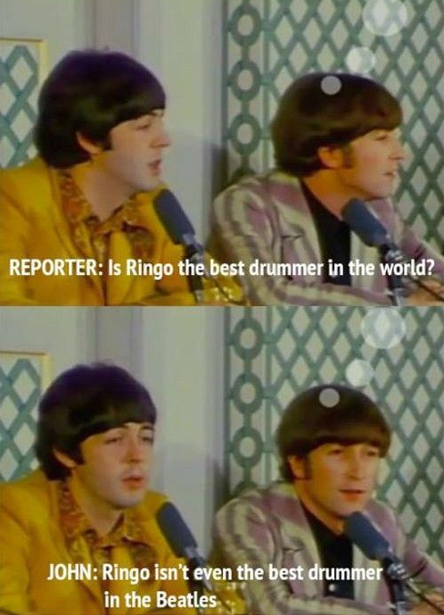

Sun Jan 04 13:22:37

RT @mulegirl: 10 Comics That Shut Down Terrible Internet Arguments http://io9.com/10-comics-that-shut-down-terrible-internet-arguments-1677109868

----

Thu Jan 08 10:33:12

RT @Nico3333fr: #CharlieHebdo avait déjà répondu à ce genre de conneries https://twitter.com/MLP_officiel/status/553083229469937664 via une belle image : http://t.co/o4lociXD…

----

Fri Jan 09 09:25:48

RT @ianbremmer: Could be the Best Cartoon Ever 

----

Sat Jan 10 20:24:26

RT @nico_atd: on aimerait des excuses publiques @BFMTV https://twitter.com/RoblesNatalia/status/553992545408401409/photo/1

----

Mon Jan 19 14:15:56

La probabilité qu'Hollande se fasse chier dessus
http://www.canalplus.fr/c-divertissement/c-le-petit-journal/pid6515-le-petit-journal.html?vid=1196510

----

Mon Jan 19 15:43:33

http://grammarist.com/usage/whiny-whiney-whinny-whinney/

----

Wed Jan 21 20:56:04

RT @AloukaMockup: Alouka is now first mockup software on Chrome web store https://chrome.google.com/webstore/search/mockup Thanks for your support ! http://t.co/ozA…

----

Sun Jan 25 01:46:00

RT @primawesome: Tommy Lee Jones always looks like his son just told him he wants to ride unicycles professionally.

----

Wed Jan 28 11:15:06

Arguing about pseudoscience: a useful analogy http://gu.com/p/3c727/stw

----

Sun Feb 01 21:54:18

Let's not forget: walkie-talkie is translated talkie-walkie in French.

----

Mon Feb 02 21:14:21

RT @EmmanuelUrbanet: Vu comme ça on a juste l'impression qu'il a perdu 13-0 à la pétanque et qu'il doit embrasser un énorme cul. http://t.c…

----

Thu Feb 05 12:05:09

Colbert Report in the UK. 

----

Mon Mar 02 13:39:24

RT @MonologueSlamUK: Come support @JuliaLTaylor @MonologueSlamUK @stratfordeast TONIGHT! http://t.co/iZJP3nUktp http://t.co/onYTQCk101

----

Thu Mar 12 12:02:52

RT @thecodinglove: When they ask me if I had already developed with WinDev http://tmblr.co/ZW6e_t1feB64I #thecodinglove

----

Fri Mar 13 15:30:31

Do you really know what the world looks like? http://imgur.com/gallery/gIT4XaT

----

Mon Mar 23 10:50:22

Welcome to http://zombo.com/

----

Tue Mar 31 13:00:25

@soundbrenner Pulse: Wearable Device For Musicians http://igg.me/p/soundbrenner-pulse-wearable-device-for-musicians/cstw/10379198 #indiegogo via @indiegogo

----

Tue Mar 31 18:56:27

RT @urbinainmusic: Great #classicalbuzz after last night's concert with @LondonCityOrch and @piecesofeight choir! Great fun!

----

Wed Apr 08 21:22:39

C flat scale exists... http://en.wikipedia.org/wiki/C-flat_major

----

Thu Apr 16 21:24:47

Pas facile d'être Sid Marcus: http://www.dailymotion.com/video/xo68q_pas-facile-d-etre-sid-marcus_creation

----

Tue Apr 28 15:09:15

RT @kek_zanorg: J'ai fait une nouvelle appli gratuite iOS &amp; Android qui vous permet de faire une tête bien crétine: http://www.stupidizer.com …

----

Mon May 04 12:54:15

RT @centraleparis: Après le @BalDesVampires, la centralienne @RafaelleCohen s'illustre dans une... pub pour @renault_uk https://t.co/EskDEP…

----

Thu May 14 07:14:23

RT @etrepublicains: j'ai signé la pétition http://www.noussommeslesrepublicains.org
ET VOUS ? (please RT)
http://www.liberation.fr/debats/2015/05/05/republicains-non-au-hold-up-semantique-de-nicolas-sarkozy_1291116?refresh=946902

----

Fri May 15 22:09:06

http://uncyclopedia.wikia.com/wiki/C_Flat

----

Thu May 21 21:21:10

RT @belsizerugby: Dear fans of @belsizerugby anyone up for a friendly summer game of #cricket like on the beach in #barbados followed by cl…

----

Mon Jun 01 13:58:30

Goodbye, @sourceforge.
It’s sad to look at what has become of you.
http://helb.github.io/goodbye-sourceforge/

----

Thu Jun 04 10:48:21

La Menace (Complètement) Fantôme
https://www.youtube.com/watch?v=cC7QRT9refU

----

Tue Jul 21 13:13:30

RT @LondonCityOrch: Next term's rep: Mussorgsky A Night on a Bare Mountain, Montero Concerto for Violin and String Orchestra, Vaughan Willi…

----

Wed Aug 26 12:00:45

@SebastienChemin @Rue89 http://bit.ly/1NB6Zdc ;)

----

Thu Sep 17 12:59:51

The Beatles sassiness 

----

Mon Sep 21 14:57:03

Bolloré, son empire en 10 minutes : Françafrique, médias, censure et petits papiers - Blabla #08

https://www.youtube.com/watch?v=VbGmUWHMIcg

----

Thu Sep 24 08:40:03

I’d like to add you to my professional network on LinkedIn.
http://www.avclub.com/article/there-are-3-captions-work-every-new-yorker-cartoon-225766

----

Fri Sep 25 12:47:47

I joined the lottery to see @lesmisofficial Anniversary Gala show with @TodayTixUK! Enter here http://go.todaytix.com/LesMizGala #LesMiz30

----

Fri Sep 25 22:45:15

I made a tool to help transposition http://xade.eu/transposer/ #horn #musictheory #edmusictheory @musictheorymooc

----

Sat Sep 26 09:58:00

@mojosarmy @musictheorymooc thank you!

----

Tue Sep 29 12:03:42

Let's have fun with #googletranslate http://xade.eu/fun-with-google-translate/

----

Mon Oct 26 18:11:19

@octplane did you know about pandoc ? http://pandoc.org/

----

Tue Nov 03 15:11:18

http://xade.eu/french-horn/ #FrenchHorn

----

Mon Nov 16 12:26:39

RT @CSalines: @nadine__morano vous êtes en train de dire que VOUS auriez pu éviter la mort de ma sœur? Fermez la donc!!!!

----

Thu Nov 19 13:24:36

Freelance or Employee: https://www.hopwork.fr/freeoremployee

----

Fri Nov 20 13:51:08

Best Selfie Stick ever:

https://www.youtube.com/watch?v=Nj-CarSGo-4

----

Mon Nov 23 13:42:06

Meanwhile in America: http://i.imgur.com/VJBsjmJ.jpg

----

Fri Nov 27 11:13:24

RT @pants: Family Fun 

----

Tue Dec 01 19:20:37

RT @gameofkittens: An elegant solution to a tricky problem:
http://explodingkittens.com/kittyconvict
#kittyconvict #givingtuesday 

----

Thu Dec 10 23:35:50

@skeetmoses @musictheorymooc ah. Thanks. Which ones?

----

Sat Dec 19 12:45:35

Matilda is Hermione https://www.reddit.com/r/FanTheories/comments/1d5wlu/matilda_from_matilda_grows_up_to_be_hermione/