[Wed Jan 04 18:58:42 +0000 2017](https://twitter.com/x4d3/status/816720528358670336)

Did Inadequate Women’s Healthcare Destroy Star Wars’ Old Republic?

http://motherboard.vice.com/read/womens-healthcare-star-wars

----

[Tue Jan 10 10:40:58 +0000 2017](https://twitter.com/x4d3/status/818769597566484484)

WTF France
Spot on
https://www.youtube.com/channel/UC9pVaOtZ8vdLBrlHu5xaaOA

@WTFFranceTV

----

[Fri Jan 20 14:26:37 +0000 2017](https://twitter.com/x4d3/status/822450262430388224)

The transformative power of classical music https://www.ted.com/talks/benjamin_zander_on_music_and_passion?utm_source=twitter.com&utm_medium=social&utm_campaign=tedspread via @TEDTalks

----

[Sat Jan 28 12:58:05 +0000 2017](https://twitter.com/x4d3/status/825327084792852480)

RT @JeremyCliffe: Berlin's mayor just issued this message for Donald Trump. It's quite something. http://www.berlin.de/rbmskzl/aktuelles/pressemitteilungen/2017/pressemitteilung.555498.php https://t.co/B8Sg…

----

[Thu Feb 02 11:53:17 +0000 2017](https://twitter.com/x4d3/status/827122714838183937)

Obi-Wan Remembers The Truth
https://www.youtube.com/watch?v=hN74bOubUug

----

[Sat Feb 11 10:50:24 +0000 2017](https://twitter.com/x4d3/status/830368383745060864)

https://youtu.be/yP9Qt-bSz40

----

[Tue Feb 14 14:09:40 +0000 2017](https://twitter.com/x4d3/status/831505695044431873)

'Mars' from The Planets, by Gustav Holst
With @LondonCityOrch and @urbinaconductor
https://www.youtube.com/watch?v=X7ZjbS5Znsk

----

[Wed Mar 01 12:53:10 +0000 2017](https://twitter.com/x4d3/status/836922260095127556)

http://dilbert.com/strip/2016-12-04 

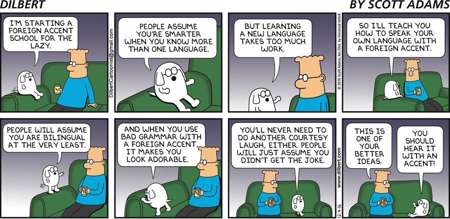

----

[Wed Mar 01 13:26:52 +0000 2017](https://twitter.com/x4d3/status/836930739824439297)

RT @GKPlugInBaby: Quand t'as plus d'ouvriers, d'armées ni de bâtiments de production mais que tu fais voler ton Command Center aux quatre c…

----

[Sat Mar 04 13:55:11 +0000 2017](https://twitter.com/x4d3/status/838025030281936897)

RT @LeanITSummit: #LeanIT2017 New session!
@bast0che will be looking back on 1 year of #LeanIT to build Auchan:Direct's new website
https:/…

----

[Mon Mar 06 17:50:30 +0000 2017](https://twitter.com/x4d3/status/838809026318172161)

Law of Demeter https://en.wikipedia.org/wiki/Law_of_Demeter

----

[Wed Mar 08 17:18:55 +0000 2017](https://twitter.com/x4d3/status/839525851993628673)

https://en.wikipedia.org/wiki/Terminology_of_the_British_Isles 

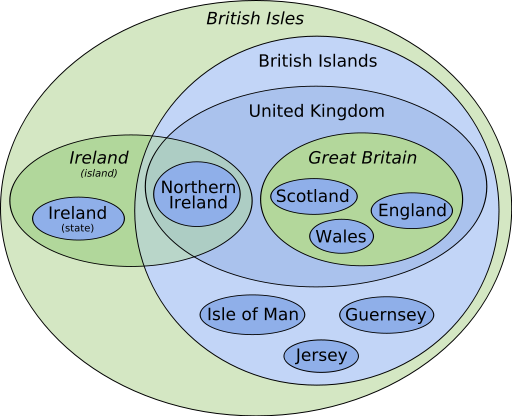

----

[Fri Mar 10 22:55:05 +0000 2017](https://twitter.com/x4d3/status/840335227683770368)

RT @benjaminbenben: Fun fact: a litre of water weighs 1kg. 

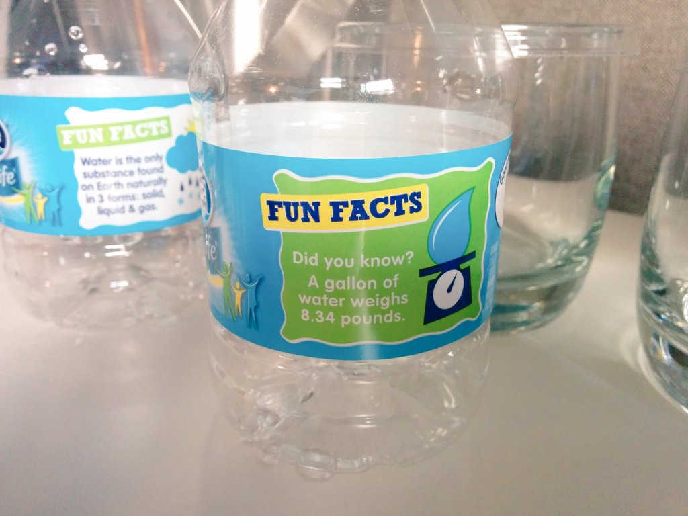

----

[Tue Mar 14 11:32:26 +0000 2017](https://twitter.com/x4d3/status/841612986041131008)

Thank you @BritishGasHelp for the very nice support. @BritishGas 

----

[Fri Mar 17 11:08:15 +0000 2017](https://twitter.com/x4d3/status/842694059827388416)

#Yesod is a Haskell web framework for development of type-safe, RESTful, high performance web applications.
http://www.yesodweb.com

----

[Mon Mar 20 11:59:46 +0000 2017](https://twitter.com/x4d3/status/843794189150228480)

"Dearer" in British English means "more expensive". That's a cute way to say it.

----

[Thu Mar 23 17:20:43 +0000 2017](https://twitter.com/x4d3/status/844962122106834945)

Drake's List of The Most Common Logical Fallacies
http://www.webpages.uidaho.edu/eng207-td/Logic%20and%20Analysis/most_common_logical_fallacies.htm
@uidaho

----

[Thu Mar 23 22:21:55 +0000 2017](https://twitter.com/x4d3/status/845037922869035013)

demisemihemidemisemiquaver
https://en.m.wikipedia.org/wiki/Two_hundred_fifty-sixth_note

----

[Tue Mar 28 07:52:58 +0000 2017](https://twitter.com/x4d3/status/846631184931151872)

27 mars 2017- La légende de Zelda Clémence.

----

[Fri Mar 31 10:46:25 +0000 2017](https://twitter.com/x4d3/status/847761995944386561)

Tchaikovsky Symphony No.5 - First Movement - Z
https://youtu.be/NeNeQrUXymg?t=14m36s 

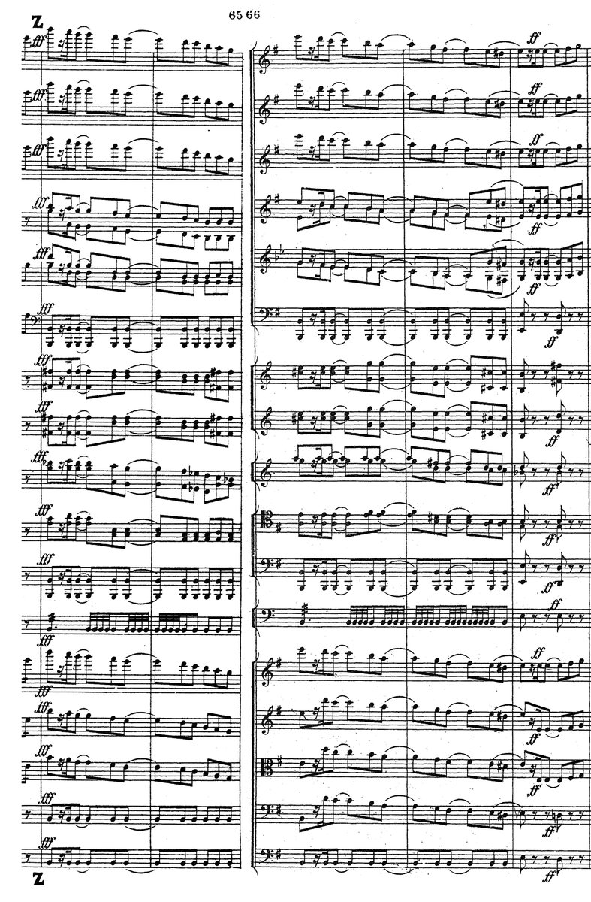

----

[Sat Apr 01 12:13:45 +0000 2017](https://twitter.com/x4d3/status/848146363699298305)

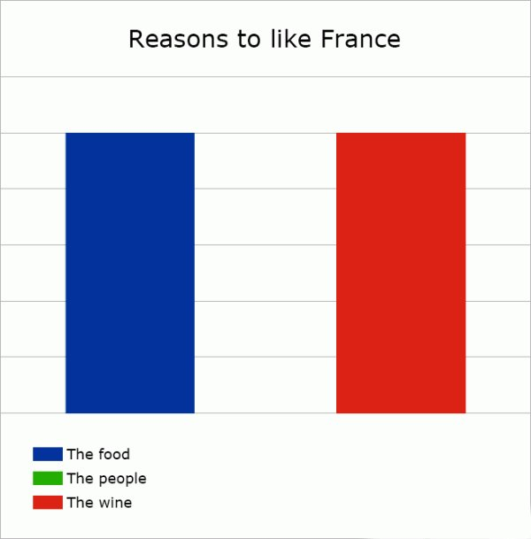

----

[Thu Apr 06 21:37:36 +0000 2017](https://twitter.com/x4d3/status/850100201922678784)

http://classic.battle.net/war2/
@Blizzard_Ent is still maintaining it, and it looks so retro

----

[Fri Apr 07 08:08:03 +0000 2017](https://twitter.com/x4d3/status/850258857192431617)

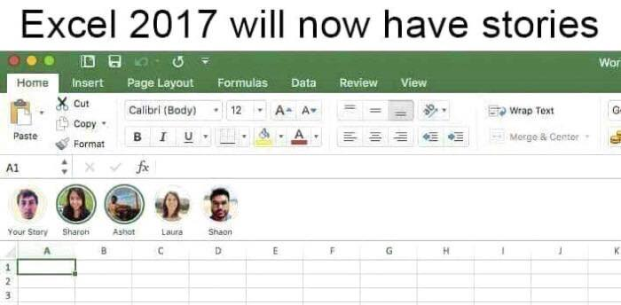

----

[Sun Apr 09 09:46:07 +0000 2017](https://twitter.com/x4d3/status/851008314318213120)

Blue Devils Space Chords https://www.youtube.com/watch?v=2EDIDCdy5Es

----

[Wed Apr 12 07:32:09 +0000 2017](https://twitter.com/x4d3/status/852061762077831168)

The Website Obesity Crisis

http://idlewords.com/talks/website_obesity.htm

----

[Thu Apr 13 22:06:59 +0000 2017](https://twitter.com/x4d3/status/852644310537424896)

RT @starwars: May the Force be with you. #SWCO #StarWars40th 

<video controls width="600" height="450">
<source src="media/852644310537424896-9etw4cgrMtqJxDrf.mp4">Your browser does not support the video tag: <a href="media/852644310537424896-9etw4cgrMtqJxDrf.mp4">media/852644310537424896-9etw4cgrMtqJxDrf.mp4</a>
</video>

----

[Mon Apr 17 15:18:16 +0000 2017](https://twitter.com/x4d3/status/853991003606437888)

French elections on @LastWeekTonight by @iamjohnoliver 
https://youtu.be/hkZir1L7fSY

----

[Wed Apr 19 14:28:27 +0000 2017](https://twitter.com/x4d3/status/854703243036962816)

I am now on #mastodon https://mamot.fr/@xade

----

[Wed Apr 26 22:59:53 +0000 2017](https://twitter.com/x4d3/status/857368663665647617)

Voici un petit simulateur du resultat du #secondtour des #ElectionsPresidentielles2017 en fonction des reports
http://xade.eu/simulateur-second-tour

----

[Wed Apr 26 23:16:22 +0000 2017](https://twitter.com/x4d3/status/857372812188807172)

Vous pouvez même partager L’URL des différents scénarios.

Par exemple, dans celui ci, Le Pen gagne.

http://xade.eu/simulateur-second-tour/#?first=0,100,0,10,30,83,10,33,15,0,5,5&second=0,0,100,60,5,3,60,33,10,95,5,5

----

[Thu Apr 27 07:29:37 +0000 2017](https://twitter.com/x4d3/status/857496944347938816)

RT @MaxCRoser: Why you should not use pie charts. 

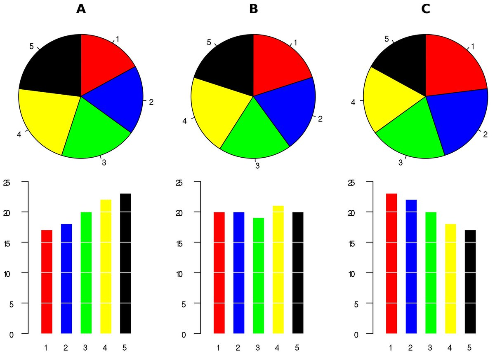

----

[Thu Apr 27 09:47:12 +0000 2017](https://twitter.com/x4d3/status/857531567564095488)

@JLMelenchon Pour info, voici un petit outil pour simuler les resultats du second tour en fonction des reports de voix: http://xade.eu/simulateur-second-tour

----

[Thu Apr 27 11:26:16 +0000 2017](https://twitter.com/x4d3/status/857556497806569478)

@libe @_hashking @johanhufnagel Pour info, voici un petit outil pour simuler les resultats du second tour en fonction des reports de voix: http://xade.eu/simulateur-second-tour

----

[Thu Apr 27 23:17:51 +0000 2017](https://twitter.com/x4d3/status/857735573527826432)

pygit: Just enough git to create a repo, commit, and push itself to GitHub
http://benhoyt.com/writings/pygit/

----

[Sat Apr 29 07:32:44 +0000 2017](https://twitter.com/x4d3/status/858222503927451648)

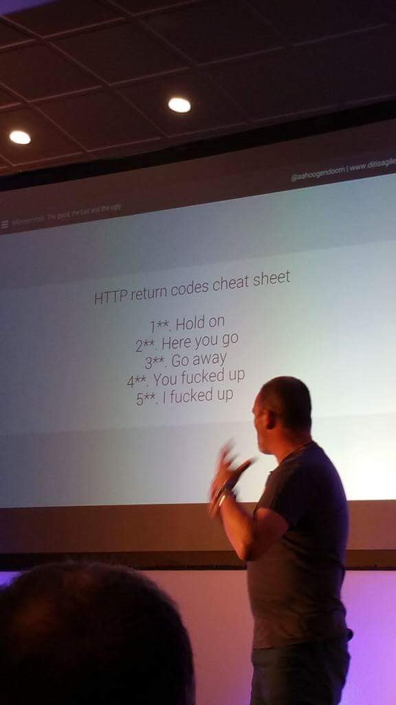

----

[Thu May 18 09:19:45 +0000 2017](https://twitter.com/x4d3/status/865134804119023616)

https://www.youtube.com/watch?v=RZkIAVGlfWk&feature=youtu.be&t=42m56s 

----

[Tue May 23 16:46:47 +0000 2017](https://twitter.com/x4d3/status/867059243005997056)

Brahms, Symphony Nr 3 F Dur op 90 Leonard Bernstein, Wiener Philharmoniker
https://www.youtube.com/watch?v=4L0MqnAoEJM&t=31m11s 

----

[Thu Jun 08 15:00:18 +0000 2017](https://twitter.com/x4d3/status/872830650230988801)

RT @Kasparov63: We meet again... 

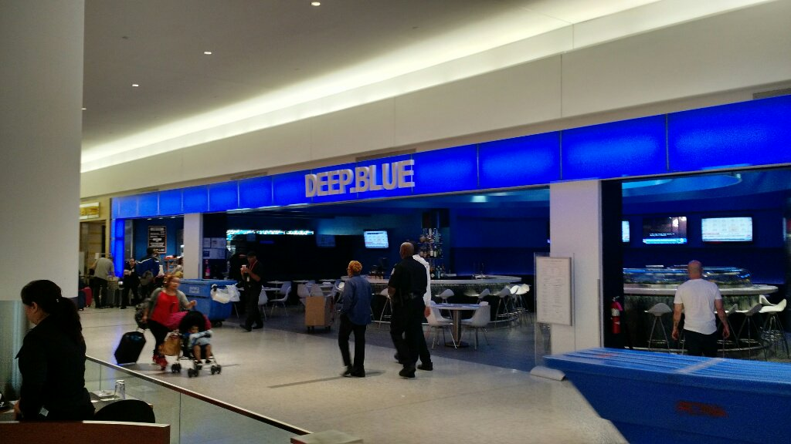

----

[Sun Jun 18 13:10:14 +0000 2017](https://twitter.com/x4d3/status/876426833192996864)

Range of Musical Instruments. #music 

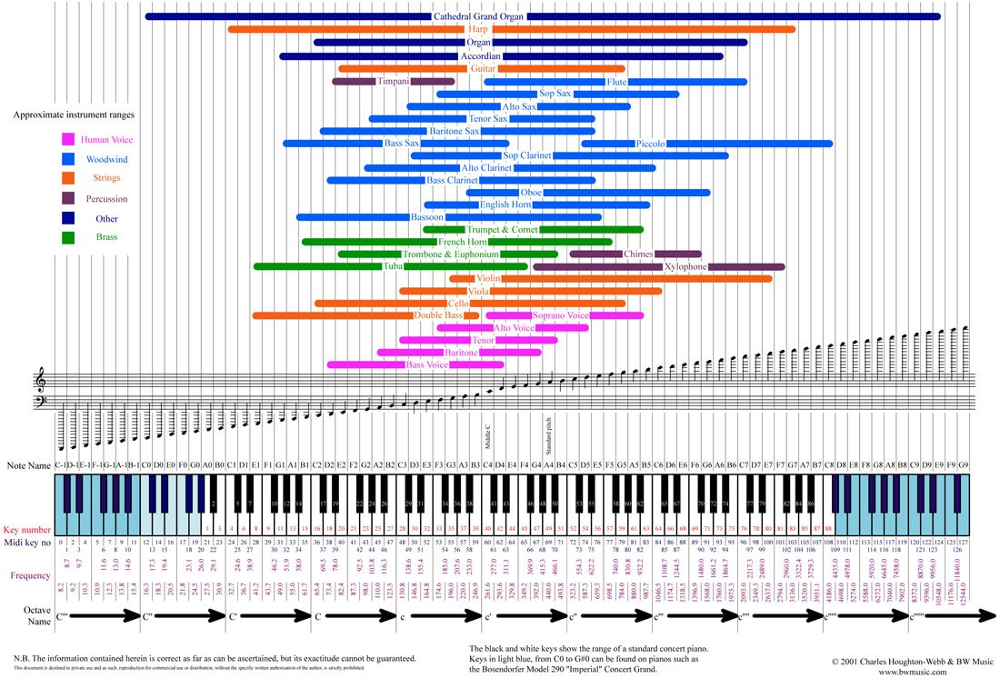

----

[Tue Jul 04 15:35:52 +0000 2017](https://twitter.com/x4d3/status/882261687595880449)

Rachmaninoff: Piano Concerto no.2 op.18 - Anna Fedorova - Complete Live Concert - HD https://www.youtube.com/watch?v=rEGOihjqO9w

----

[Wed Jul 05 19:02:32 +0000 2017](https://twitter.com/x4d3/status/882676086404001793)

RT @BubblePlan: #Stage #tech #Developpement à faire tourner...
une expérience géniale est à vivre dans notre #startup #SaaS. Rejoignez-nous…

----

[Thu Jul 13 15:23:33 +0000 2017](https://twitter.com/x4d3/status/885520077508030464)

Sibelius, Symphonie Nr 5
https://youtu.be/dACRUFfmMeo?t=27m42s
Page 103/134
http://xade.eu/french-horn/Sibelius_-_Symphony_No.5,_Op.82_(orch._score).pdf

#FrenchHorn #Music #MusicSheet 

----

[Wed Jul 26 14:40:30 +0000 2017](https://twitter.com/x4d3/status/890220287538679809)

It's a big ad. https://www.youtube.com/watch?v=_wM2c3WtDjQ

----

[Wed Jul 26 15:48:23 +0000 2017](https://twitter.com/x4d3/status/890237368812404736)

@rubymine Thank you for making my life so much easier!

----

[Fri Jul 28 11:57:27 +0000 2017](https://twitter.com/x4d3/status/890904030616190977)

RT @acupoftim: Bon à savoir : les pouvoirs magiques des cristaux. 

----

[Wed Aug 09 13:45:02 +0000 2017](https://twitter.com/x4d3/status/895279759780970497)

https://www.youtube.com/user/AnneSoshi is talented
SEVEN NATION ARMY
https://www.youtube.com/watch?v=8IQtH1aPMw8
Jon Snow | A Dragon Raised By Wolves
https://www.youtube.com/watch?v=nA_aOCU47Ss

----

[Fri Aug 11 19:45:13 +0000 2017](https://twitter.com/x4d3/status/896095177692954625)

Creep - Vintage Postmodern Jukebox Radiohead Cover ft. Haley Reinhart
https://youtu.be/m3lF2qEA2cw?list=RDEMMb5YVupu52N3eQ8SltfE3A

----

[Sun Aug 13 19:21:30 +0000 2017](https://twitter.com/x4d3/status/896813983239475200)

RT @BarackObama: "People must learn to hate, and if they can learn to hate, they can be taught to love..."

----

[Sun Aug 13 19:21:43 +0000 2017](https://twitter.com/x4d3/status/896814040378429442)

RT @BarackObama: "No one is born hating another person because of the color of his skin or his background or his religion..." https://t.co/…

----

[Tue Sep 12 13:32:13 +0000 2017](https://twitter.com/x4d3/status/907597719694446600)

RT @LondonCityOrch: Attention strings, trumpets and trombones - we're recruiting! Join us in playing Tchaikovsky's Fifth Symphony https://t…

----

[Tue Sep 12 13:41:37 +0000 2017](https://twitter.com/x4d3/status/907600087282569216)

The Devil's Delorean https://youtu.be/8I3zWYa7l1I

----

[Wed Sep 27 14:31:40 +0000 2017](https://twitter.com/x4d3/status/913048498194587648)

Sergei Prokofiev : Romeo and Juliet, Suite No. 2 from the ballet Op. 64ter
https://www.youtube.com/watch?v=Ie947mSm3iA&feature=youtu.be&t=19m21s 

----

[Tue Oct 03 16:40:49 +0000 2017](https://twitter.com/x4d3/status/915255328756916224)

The Chaos by Gerard Nolst Trenité 
http://ncf.idallen.com/english.html

----

[Wed Oct 04 08:14:30 +0000 2017](https://twitter.com/x4d3/status/915490296275832833)

Why does PUNCHING Sonic 3D trigger a Secret Level Select?

https://www.youtube.com/watch?v=i9bkKw32dGw

----

[Tue Oct 10 09:58:36 +0000 2017](https://twitter.com/x4d3/status/917690823302623232)

Brass Ostinato are the best.
https://youtu.be/Gn0WzX3OcAU?t=1m12s
https://youtu.be/wA1v207xlOw?t=2m55s
https://youtu.be/L0bcRCCg01I?t=4m24s 

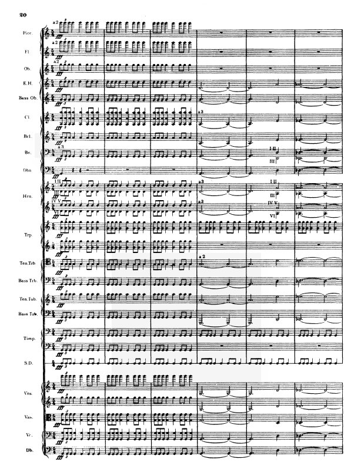

----

[Wed Oct 11 10:59:52 +0000 2017](https://twitter.com/x4d3/status/918068629811421184)

Line Rider - Mountain King
https://www.youtube.com/watch?v=RIz3klPET3o&feature=youtu.be

----

[Sat Oct 14 19:23:13 +0000 2017](https://twitter.com/x4d3/status/919282464064987137)

RT @jschauma: So all y’all know that UserAgent strings are total bullshit, right? 

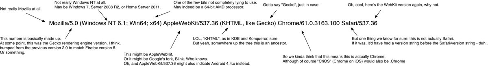

----

[Thu Oct 26 07:16:02 +0000 2017](https://twitter.com/x4d3/status/923448117176958977)

RT @Oatmeal: Reaching people on the internet. 

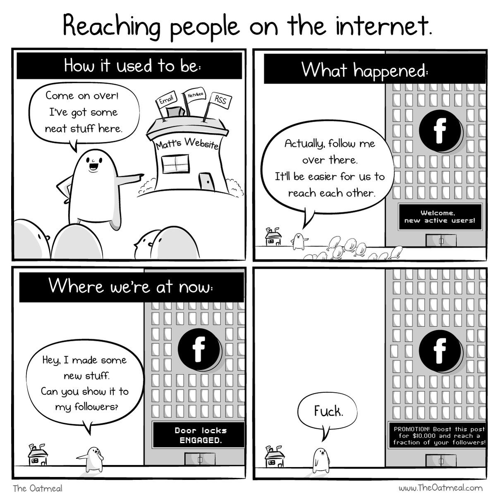

----

[Fri Oct 27 09:21:04 +0000 2017](https://twitter.com/x4d3/status/923841969528430592)

RT @Unpied: "C'est pour votre bien, hein".

(Youpi, le recueil de la saison 2 est sorti ! http://librairie.lapin.org/librairie/271-ab-absurdo-2-9782918653974.html) 

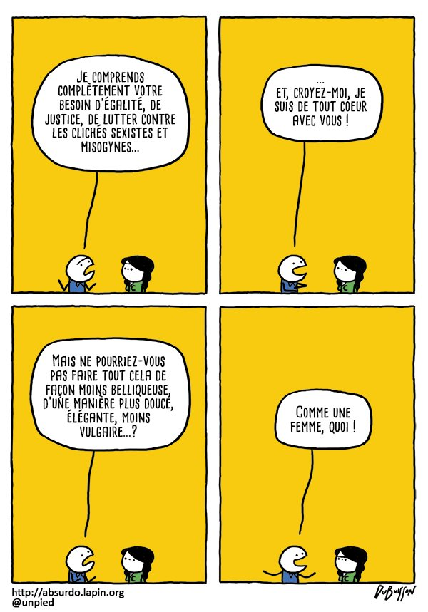

----

[Fri Oct 27 15:00:52 +0000 2017](https://twitter.com/x4d3/status/923927485703753733)

RT @RoKhanna: In Portugal, with no net neutrality, internet providers are starting to split the net into packages. 

----

[Thu Nov 16 09:27:54 +0000 2017](https://twitter.com/x4d3/status/931091446303723523)

RT @Bouletcorp: Bonjouuuur Paaaariiiiis!
Une nouvelle note de blog pour vous en ce petit matin glacial!
Nous y parlerons d'Hollywood et d'u…

----

[Fri Nov 17 10:48:17 +0000 2017](https://twitter.com/x4d3/status/931474063301672960)

Bernstein: Symphonic Dances from West Side Stories
https://www.youtube.com/watch?v=J_NelA3ZW4g&feature=youtu.be&t=4m51s 

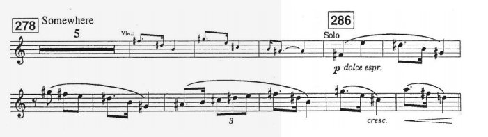

----

[Tue Nov 21 15:11:14 +0000 2017](https://twitter.com/x4d3/status/932989789535719425)

RT @jschauma: TIL: GNU man(1), when invoked at 00:30 without args, prints "gimme gimme gimme" as an Abba reference: https://unix.stackexchange.com/questions/405783/why-does-man-print-gimme-gimme-gimme-at-0030…

----

[Thu Nov 30 14:09:12 +0000 2017](https://twitter.com/x4d3/status/936235668858195969)

https://www.socialcooling.com

----

[Fri Dec 01 09:14:49 +0000 2017](https://twitter.com/x4d3/status/936523974556692480)

Happy 1st of December !

https://adventofcode.com #AdventOfCode

----

[Wed Dec 06 15:48:30 +0000 2017](https://twitter.com/x4d3/status/938434987409526785)

The On-Line Encyclopedia of Integer Sequences https://oeis.org/

----

[Thu Dec 07 10:47:22 +0000 2017](https://twitter.com/x4d3/status/938721592816947200)

B-Dash &amp; Jaja Vankova | FrontRow https://youtu.be/XC8zfRWS5HM

----

[Fri Dec 08 22:59:33 +0000 2017](https://twitter.com/x4d3/status/939268236746600448)

Fatboy Slim - Weapon of Choice

https://youtu.be/wCDIYvFmgW8

----

[Wed Dec 13 23:20:20 +0000 2017](https://twitter.com/x4d3/status/941085408250814469)

RT @Bouletcorp: "French is Weird" #05
Today: Butts.
A deep and touchy subject.
#Butts 

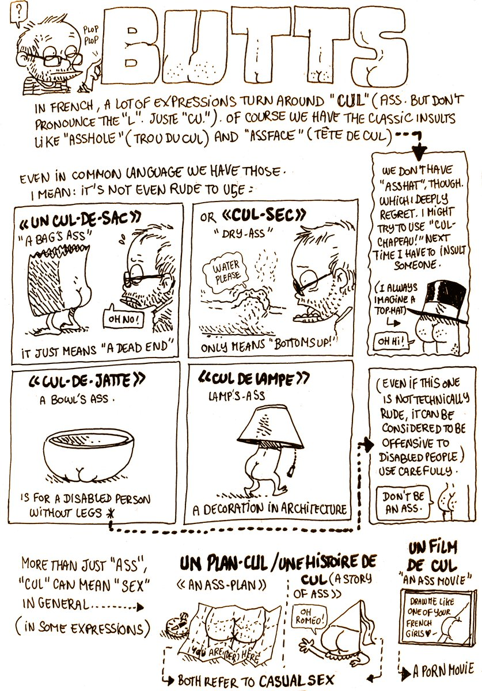

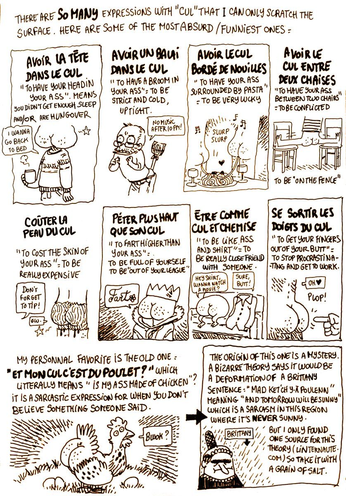

