Mon Jan 06 08:48:17

RT @jsjoeio: ICYDK 

&lt;kbd&gt;: The Keyboard Input element is handy if you're sharing a keyboard shortcut in your markup or markdown

https://t…

----

Mon Jan 13 10:10:11

Why Britain Uses Separate Hot and Cold Taps

https://www.youtube.com/watch?v=HfHgUu_8KgA

----

Fri Jan 17 08:44:57

RT @GillusZG: 


----

Fri Jan 31 12:35:16

RT @joshua_pieters: Here it is-  I Flew Katie Hopkins to Prague to win a Fake Award.  https://youtu.be/eRIdtMlqwNA

----

Sat Feb 01 16:29:04

RT @ByDonkeys: Hey @BorisJohnson and @Nigel_Farage, we just made Big Ben bong for you😉. Sound on. 

<video controls width="600" height="450">
<source src="media/1223644445054251012-MTHYkQK_12EhHBdP.mp4">Your browser does not support the video tag: <a href="media/1223644445054251012-MTHYkQK_12EhHBdP.mp4">media/1223644445054251012-MTHYkQK_12EhHBdP.mp4</a>
</video>


----

Fri Feb 07 14:56:26

RT @CptnBarberousse: Pensez-y chaque fois que vous lirez les messages larmoyants d'Isabelle Balkany à propos de son mari en prison. 
Pensez…

----

Wed Feb 12 08:22:26

The Bibi-binary system for numeric notation (in French système Bibi-binaire, or abbreviated "système Bibi") is a hexadecimal numeral system first described in 1968 by singer/mathematician Robert "Boby" Lapointe (1922–1972).

https://en.wikipedia.org/wiki/Bibi-binary 

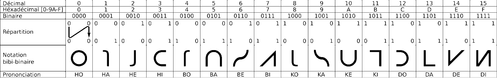

----

Sun Mar 08 17:57:10

RT @raganwald: “The most severe-form of the Dunning-Kruger Effect afflicts those who are genuinely talented in one area of their lives, and…

----

Mon Mar 09 09:26:07

Hollow Knight: Symphonic Suite | Orchestral Cover
by @VGOScore  is amazing !
https://www.youtube.com/watch?v=vRI6n-5ayTo

----

Tue Mar 17 21:55:54

RT @sbstryker: This video of brothers Andrew and Chris Cuomo fighting ON AIR about their mom’s favorite child, calling their parents, and b…

----

Sun Mar 22 09:30:24

@Awstein SW-1904-9769-2774

----

Mon Mar 23 20:05:44

https://placestovisitthisweekend.com/

----

Tue Mar 24 08:06:07

Good lock!

----

Sun Mar 29 14:39:41

https://framaforms.org/ouvert-a-tous-quel-confinement-vivez-vous-1585381126
De la part de @Brunomjean 

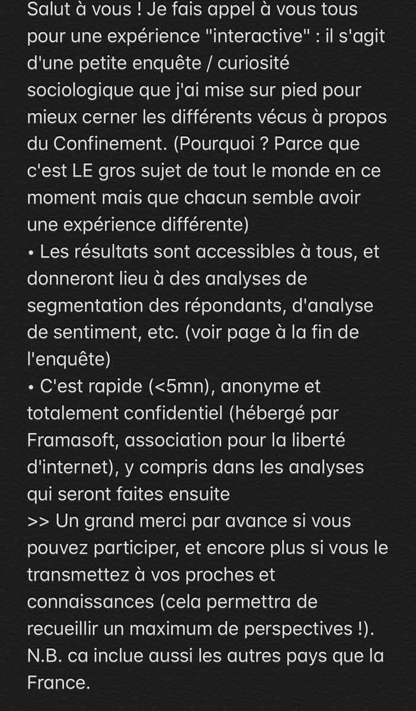

----

Mon Mar 30 12:14:15

RT @Meeea: En route pour le Pays Imaginaire ! Je vous parle des galères de Hook sur ma chaîne! Le RT serait en bonne et due forme
https://t…

----

Tue Mar 31 18:39:40

https://golang.org/pkg/time/#pkg-constants
In #golang,  
time.RFC3339 returns "2006-01-02T15:04:05Z07:00", which does look an example of what the date would like 
however 
time.Parse(time.RFC3339, time.RFC3339)
returns an error ...

----

Tue Mar 31 18:52:16

@SebastienChemin no, it's because the Z in time.RFC3339("2006-01-02T15:04:05Z07:00") is a placeholder

// Replacing the sign in the format with a Z triggers
// the ISO 8601 behavior of printing Z instead of an
// offset for the UTC zone. 

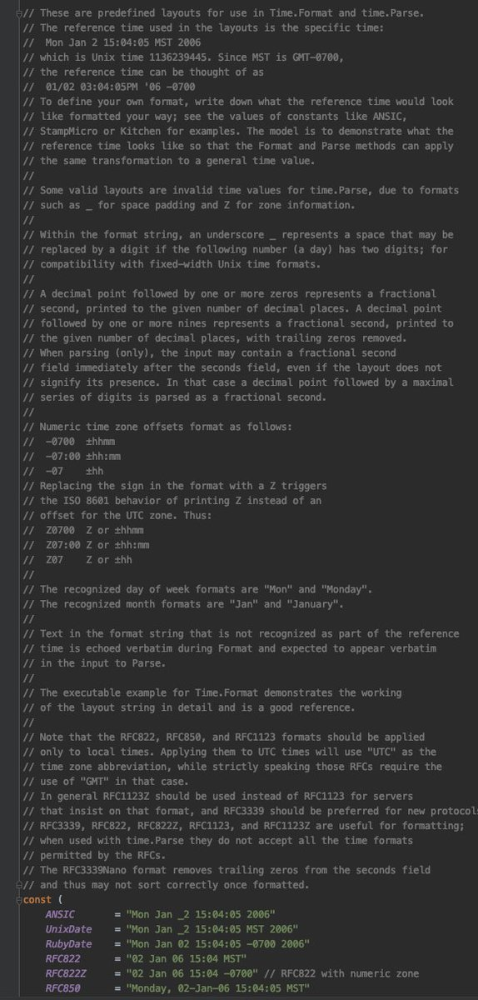

----

Tue Mar 31 19:46:16

RT @Brunomjean: Et vous quel confinement vivez-vous ?
&gt;&gt; Partagez votre vécu https://cutt.ly/ntTDnIM (100% confidentiel et anonyme, &lt;5mn)…

----

Tue Mar 31 20:13:11

@SebastienChemin @leboncoinEng Haha ;) the current project I’m working on is actually in go. But the one I really want to learn and be better at is #rustlang .

----

Wed Apr 01 09:58:00

@partialmark What did they change ?

----

Tue Apr 07 10:58:43

Thanks @8bitMusicTheory for the perfect explanation on why I am obsessed with #HollowKnight music:

Atmosphere and Motivic Development in Hollow Knight's Soundtrack
https://youtu.be/wzOY3mxTBag

----

Mon Apr 27 20:35:48

RT @gloupin: http://ethique-pandemie.com/le-contact-tracing-un-suivi-de-la-pandemie-mais-bien-plus-encore/
Tentative pour faire le point sur le contact tracing de façon modérée avec mes interrogations du momen…

----

Mon May 11 23:01:17

RT @Bouletcorp: Le gif de la migraine, par @jn3008 
(Ce compte est complètement dingue, il fait plein d'images de ce style. Son Tumblr: htt…

----

Tue May 19 15:01:55

https://www.theolognion.com/unreal-engine-5-is-meant-to-ridicule-web-developers/

----

Sun May 24 08:37:13

@SebastienChemin 👏

----

Sun May 24 08:37:20

RT @SebastienChemin: No

----

Wed May 27 08:05:26

"sudo" is pronounced the same as "pseudo"...

----

Wed May 27 12:11:15

RT @SebastienChemin: Voici mon tout premier article de blog 🎉

J'y ai résumé, en français, les points phares du #TWTechRadar 2020 de @thoug…

----

Sun May 31 15:52:11

RT @anishgiri: @chess24com Ah ok, because I thought they told him to play Fortnite to get more viewers on Twitch and he just misheard them.🤣

----

Sun May 31 16:06:48

RT @LondonCityOrch: It’s World Meditation Day, so we've got together (apart) to set the mood for you in our first LCO online project. It's…

----

Tue Jun 09 09:15:12

Bonjour @LaBanquePostale

Est ce que vous comptez investir pour remplacer votre site web complement obsolete et rempli de bug ?

C'est vraiment scandaleux. Rien ne fonctionne.

Cordialement, 

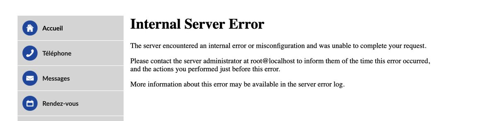


----

Thu Jun 25 12:07:33

https://www.youtube.com/watch?v=GyUcwsjyd8Q

----

Fri Jun 26 14:33:19

Really impressed by the work of @daviddpeacock of arranging @composerlarkin 's masterpiece: #HollowKnight.

In particular this passage of "Sealed Vessel" where the left hand plays 8 note while the right is playing 6 is haunting me !

https://youtu.be/grHtGa_G1Ok?t=184 

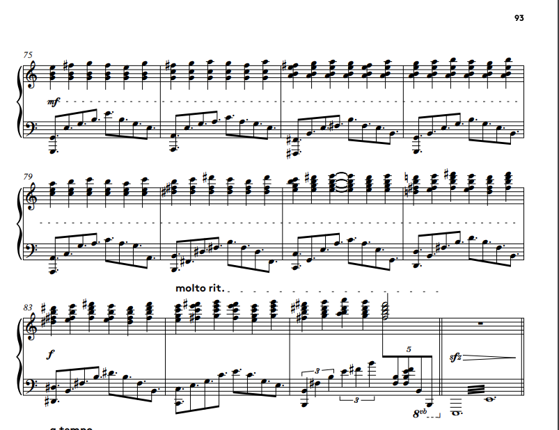

----

Tue Jun 30 13:27:24

@Chrysterious @lvgorchestra yes please ! :)

----

Mon Jul 06 22:20:15

RT @b0rk: questions about IPv4 https://questions.wizardzines.com/ip.html

----

Tue Jul 14 08:09:43

RT @LondonCityOrch: Happy Bastille Day! Sharing this again. Our latest online project is Berlioz' March to the Scaffold, the story of an op…

----

Tue Jul 14 15:55:59

Sibelius - Symphony no. 5
3rd movement - D to G
https://youtu.be/y3wC8DyRUkM?t=75 

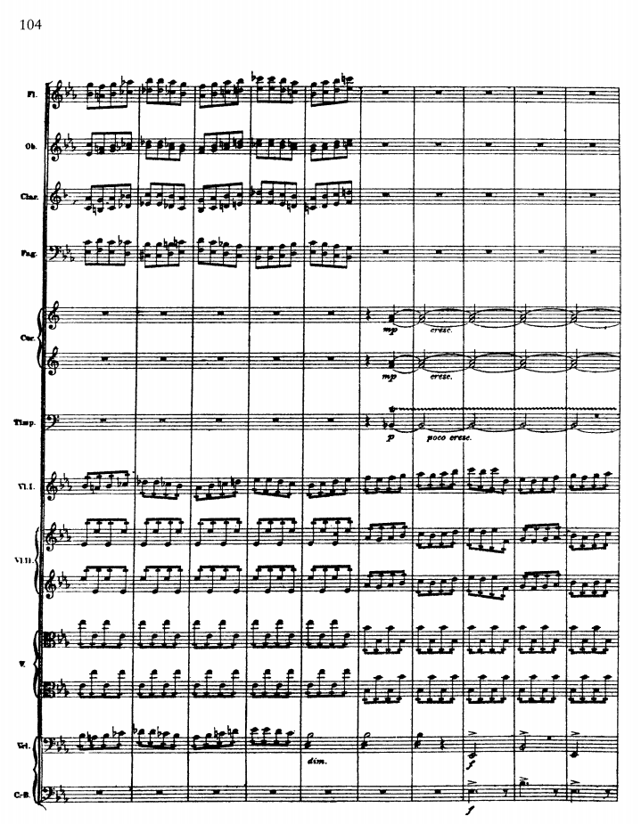

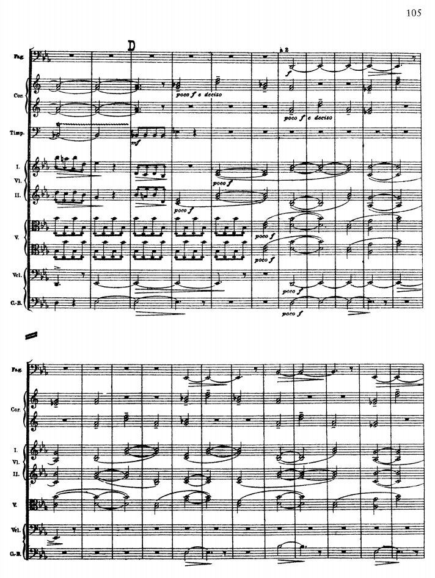


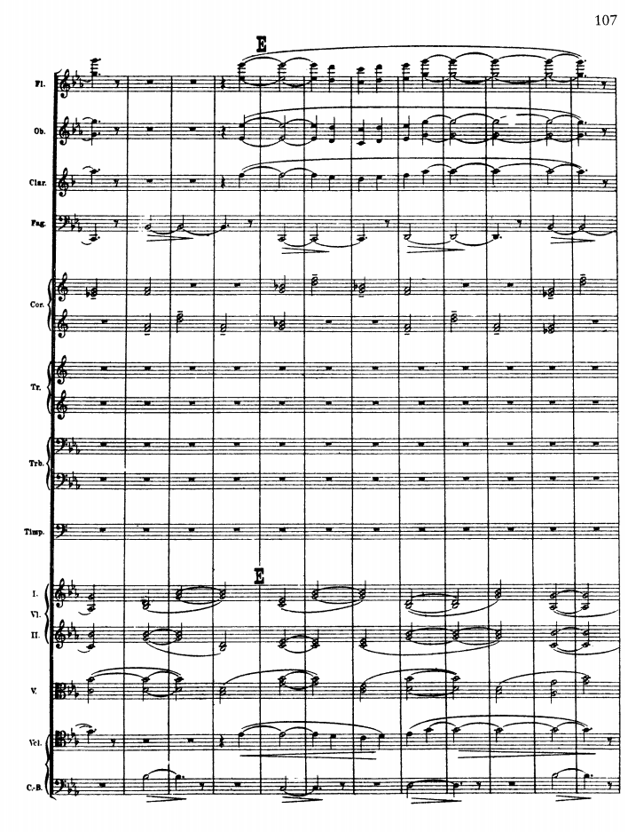

----

Thu Aug 06 07:59:12

Tom Holland's performance is just astonishing.

https://www.youtube.com/watch?v=jPCJIB1f7jk

----

Wed Aug 12 08:32:32

RT @danavedmankina: ❗️a carrd on what’s happening in belarus rn (protests bc of rigged elections, police violence, what’s new) with sources…

----

Sat Aug 15 17:35:24

RT @ARTEfr: Sur Instagram, tout est filtré, surtout la réalité 💊 http://so.arte/Dopamine 

<video controls width="600" height="450">
<source src="media/1294689158343135235-uGGYCWdTPc8viUPn.mp4">Your browser does not support the video tag: <a href="media/1294689158343135235-uGGYCWdTPc8viUPn.mp4">media/1294689158343135235-uGGYCWdTPc8viUPn.mp4</a>
</video>


----

Tue Aug 18 15:22:22

List your most recently used branched on git

https://ses4j.github.io/2020/04/01/git-alias-recent-branches/

----

Sat Aug 22 08:59:57

@SebastienChemin y en qui ont essayé, ils ont eu des problèmes, cela dit I’m est très rapide !

----

Wed Aug 26 11:18:46

https://thetruesize.com

----

Thu Aug 27 15:44:55

Two Steps From Hell - High C's (Recording Session Footage) https://youtu.be/tGh4FcZKekA via @YouTube 

This is epic. @twostepsfromhe1

----

Fri Aug 28 09:12:17

My Retros are better than yours ! 

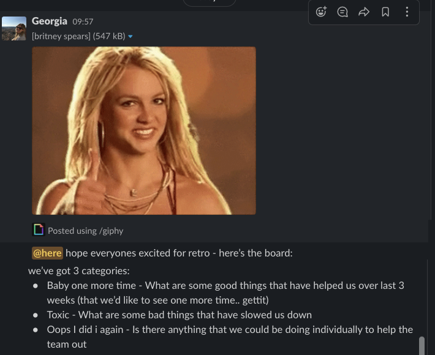

----

Fri Aug 28 09:25:28

Look at it ! 

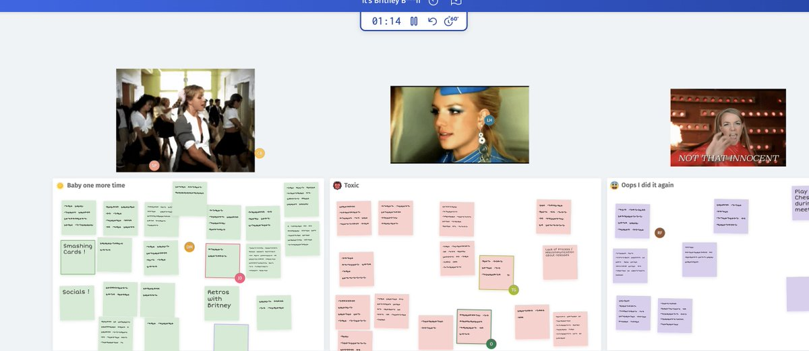

----

Sun Aug 30 10:34:32

Le substantif masculin renard est une antonomase lexicalisée résultat de l'emploi, comme nom commun, de Renart, nom propre du héros éponyme du Roman de Renart.

----

Tue Sep 01 13:30:03

RT @BrizzyVoices: i tried rapping as a cartoon character for each letter of the alphabet. 😅

alphabet aerobics by blackalicious https://t.c…

----

Tue Sep 08 08:47:00

@edmundmcmillen Did you play Hollow Knight ? What did you think ?

----

Wed Sep 16 13:29:12

Super Metroid - Mother Brain

https://youtu.be/BQxqF3WsXPY?t=138

I really like odd time signatures ! 

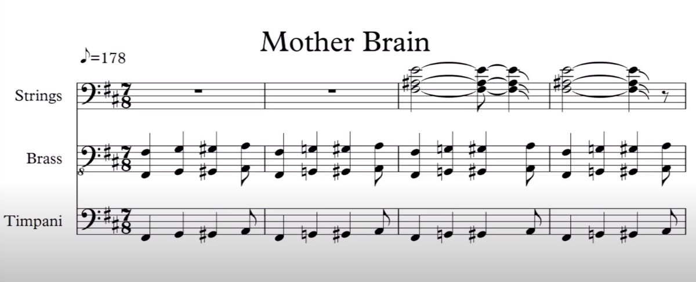

----

Wed Sep 16 15:54:50

@Mehdi_Nemlaghi @zanoellia and that does not prove anything... you can even generate a fake one if you want...
https://github.com/Shpota/github-activity-generator

----

Wed Sep 16 15:56:10

@Mehdi_Nemlaghi @zanoellia even draw images: https://github.com/gelstudios/gitfiti

----

Mon Sep 21 12:49:05

RT @belsizerugby: Looking for a rugby club in the heart of London? Then look no further! At Belsize, all players, coaches, and volunteers a…

----

Tue Sep 22 21:45:31

RT @ChucksChallenge: It’s been over 30 years since Chuck Sommerville created Chip’s Challenge. Today is goes free on Steam https://t.co/bSE…

----

Wed Sep 23 12:24:47

So I just finished l'eau des Collines from Marcel Pagnol, and I'm watching the movie that inspired the novel: Manon des sources.
It's funny to see that one of scene was re-enacted in la Gloire de mon père.

https://youtu.be/huQWYMy-cdM?t=615

----

Wed Sep 23 12:24:55

https://youtu.be/pVysDBudIjg?t=84

----

Fri Sep 25 08:10:32

https://github.com/kdeldycke/awesome-falsehood

----

Fri Sep 25 08:10:58

https://github.com/dwmkerr/hacker-laws

----

Fri Sep 25 09:32:27

My Retros are still better than yours ! 

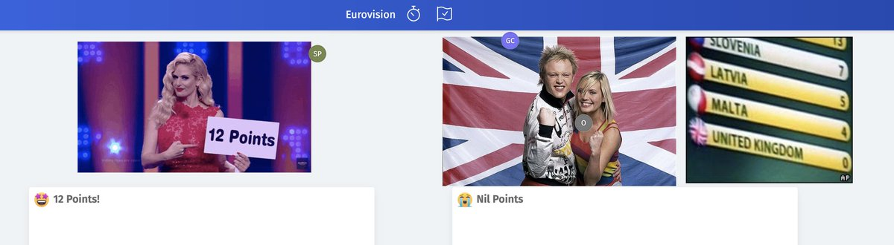

----

Mon Sep 28 12:02:00

@partialmark Wow.. where did you find that !?

----

Tue Sep 29 08:04:30

@partialmark 🤢

----

Sun Oct 11 15:52:17

You can use backtick escaping in #WhatsApp  !!!

Simply surround your code with ```

For example:
```
Your code
``` 

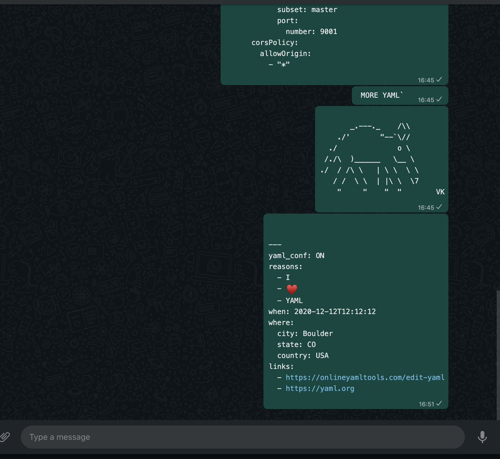

----

Wed Oct 14 13:04:46

RT @belsizerugby: If you're looking to play some cracking rugby in the heart of London, then look no further! Join Belsize Park today 🌳
htt…

----

Sun Nov 01 09:59:15

@dmy365 This is awesome! let me know how it's going.

----

Sun Nov 08 18:00:33

I've published my first ruby gem :)
https://github.com/x4d3/global_map_tiles
https://rubygems.org/gems/global_map_tiles

----

Wed Nov 11 10:35:39

They are getting better and better 

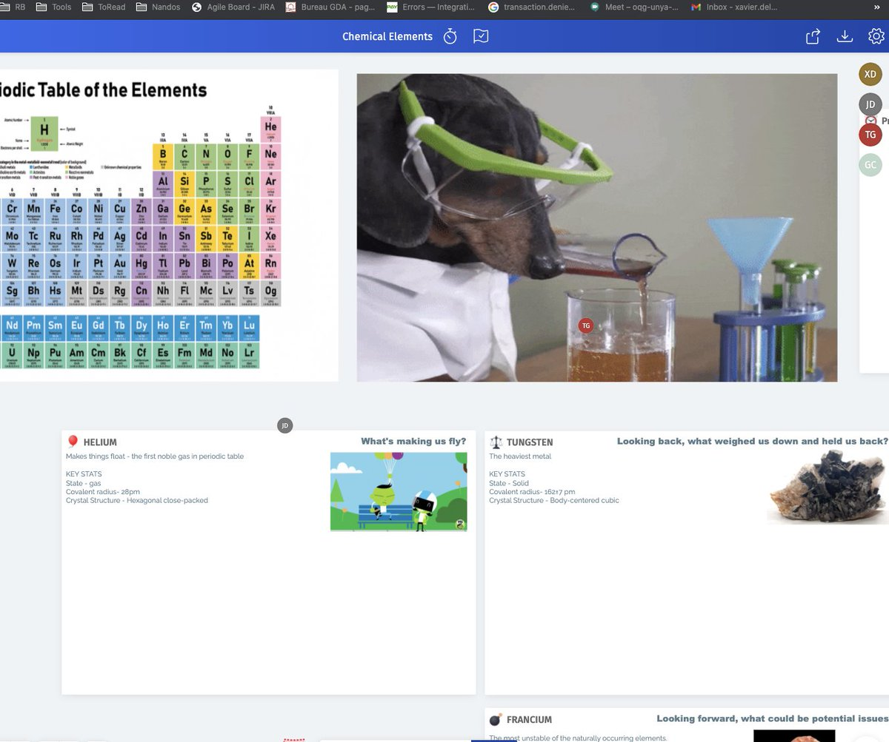

----

Wed Nov 11 12:07:10

Kudos to @SusiePurvis for the most amazing stickies ! 

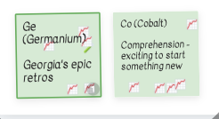

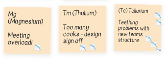

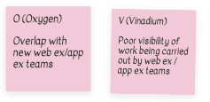

----

Thu Nov 12 12:24:40

https://www.youtube.com/watch?v=VHsHGQNo7Hg
Here is an amazing video from @RyanMcGaughey3 playing it

----

Fri Nov 13 08:19:57

@RyanMcGaughey3 I'm currently trying to play City of Tears, and your video is going to help a lot !
https://www.youtube.com/watch?v=MYg1DDAdHlI

----

Fri Nov 13 08:38:22

RT @SebastienChemin: À dérouler! https://twitter.com/Hibouch_BlogBD/status/1254414466281869312

----

Wed Nov 25 11:33:25

In @github, if you want to create a code suggestion and you want to have backticks ``` in it. All you have to do is to have one more backtick around the suggestion and it will work:

````suggestion
```
Add some backticks
```
````

----

Thu Nov 26 10:33:23

http://arcanis.github.io/secretsanta/
It's a great tool to generate Secret Santa Pairings.
No ads, No signup, no email.
It simply generate links you can share with the participants, and you can even send it to yourself without knowing the pairings.

Thank you @arcanis

----

Fri Nov 27 17:07:03

Learned a new word today which I like.
Discombobulated: confused and disconcerted

----

Tue Dec 01 23:01:59

Interesting that billion does not mean the same thing in French and in English.
In French it’s a million of million. We have “milliard” for thousands for million. 

https://en.wikipedia.org/wiki/Long_and_short_scales 

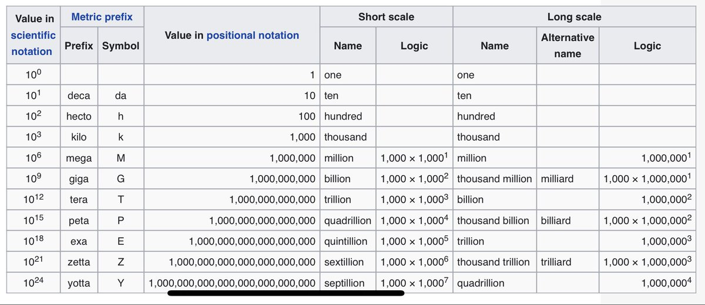

----

Wed Dec 02 11:56:01

https://stevelosh.com/blog/2013/04/git-koans/ 

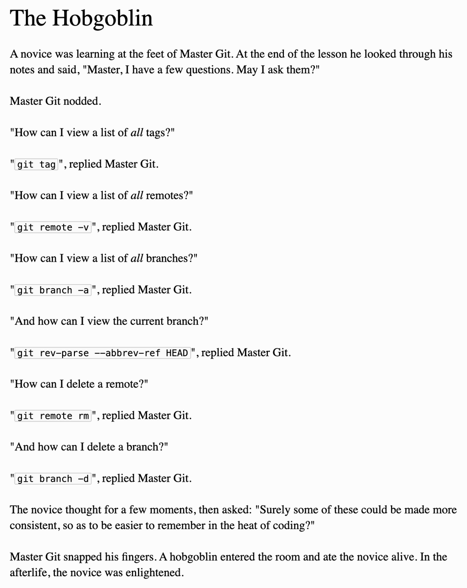

----

Fri Dec 11 10:18:53

If you would like to listen to same festive classical music, we will be live streaming with the @LondonCityOrch  saturday at 17h30:
https://youtu.be/Y6iTH0yblHo

You may do a small donation to support us :)
https://www.paypal.com/paypalme/LondonCityOrch 


----

Thu Dec 31 12:11:39

@ValRobert974 @PierreBoudes Vous pourriez ajouter:
Golang
Ruby
Javascript
C++
C#