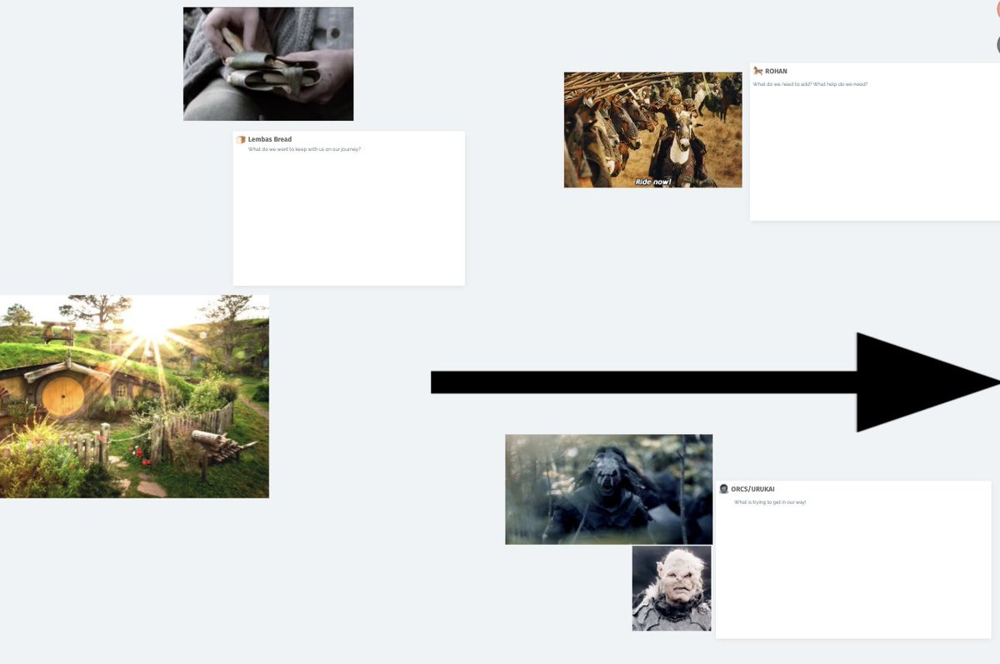
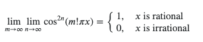
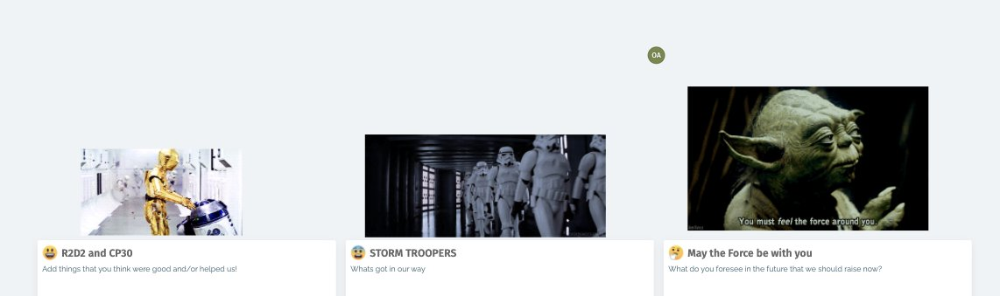
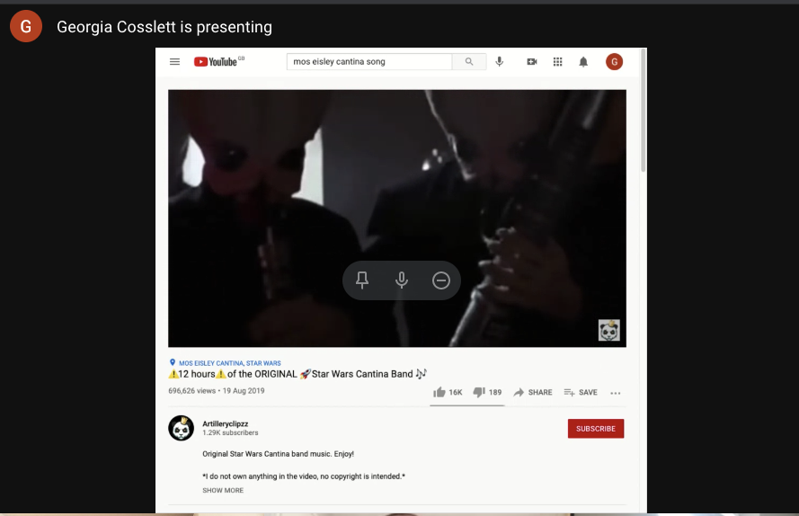
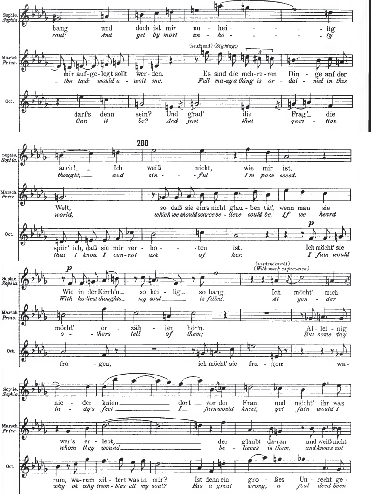
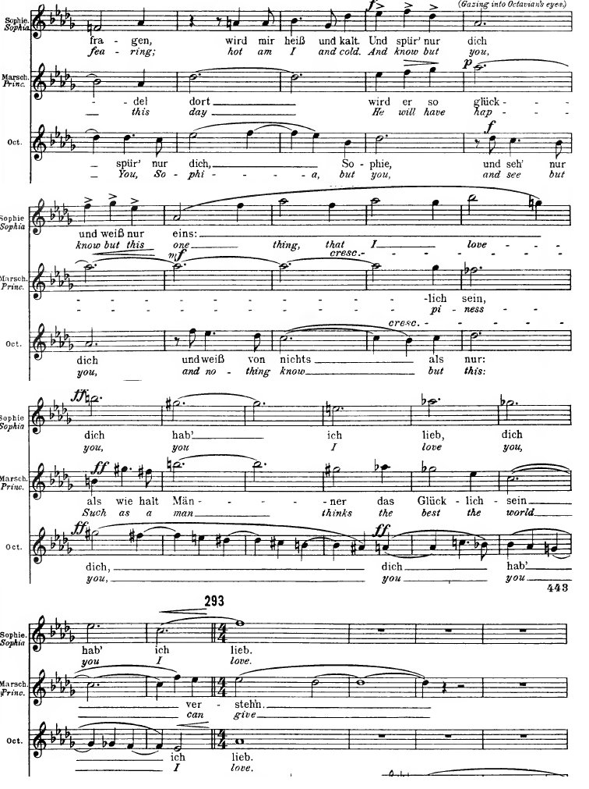
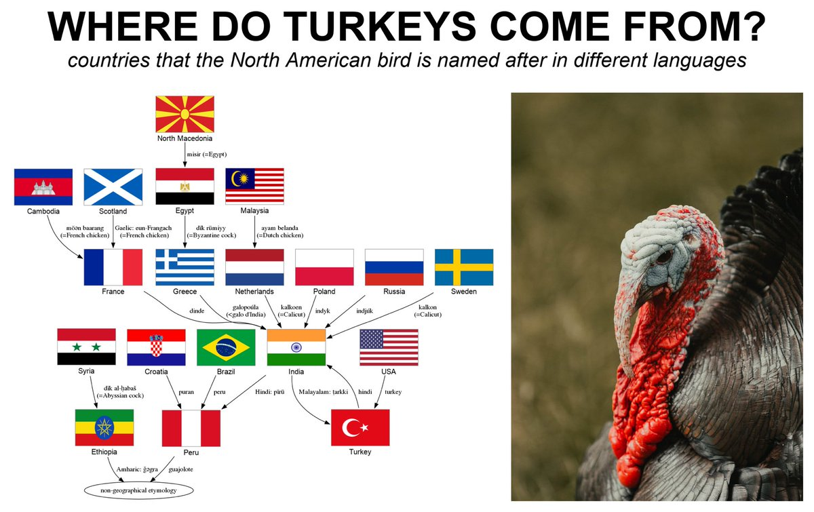
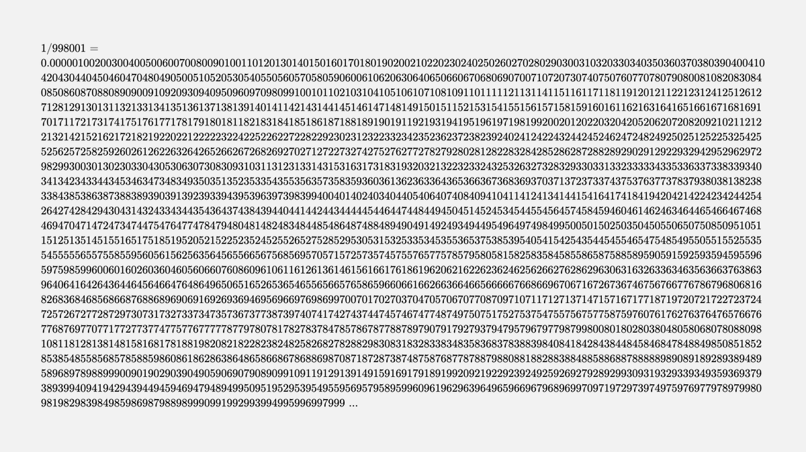
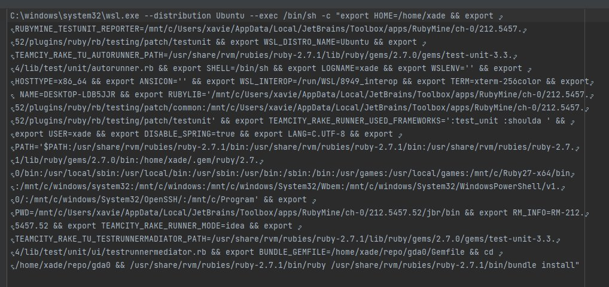
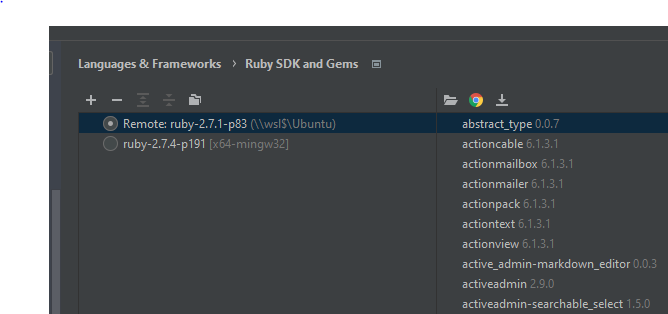

[Sat Jan 09 14:23:56 +0000 2021](https://twitter.com/x4d3/status/1347911992753987584)

Good luck to all the geeks out there trying to convince their family to migrate to @signalapp .

----

[Thu Jan 14 12:48:08 +0000 2021](https://twitter.com/x4d3/status/1349699823197433857)

From our beloved CSO @StuartHarris at @redbadgerteam 
 "What’s next, after Kubernetes?" https://awesome.red-badger.com/stuartharris/wasmcloud/

----

[Thu Jan 14 12:49:19 +0000 2021](https://twitter.com/x4d3/status/1349700119252316163)

@Bouletcorp https://www.youtube.com/watch?v=_aXIpUPfK40

----

[Tue Jan 19 19:20:50 +0000 2021](https://twitter.com/x4d3/status/1351610587567058952)

RT @smdiehl: Let's have a frank discussion about bitcoin hype. Bitcoin is really an symptom of the problems of our era, of a post-truth wor…

----

[Wed Jan 27 23:47:39 +0000 2021](https://twitter.com/x4d3/status/1354576837393969153)

RT @lichess: We just released Puzzle Storm! 🌪

How many puzzles can you solve in 3 minutes?

Have a go at https://lichess.org/storm https://t…

----

[Fri Jan 29 10:56:56 +0000 2021](https://twitter.com/x4d3/status/1355107656474763272)

Lord of the Ring Retro today ! 

----

[Fri Feb 05 10:54:58 +0000 2021](https://twitter.com/x4d3/status/1357643877231046656)

@RyanMcGaughey3 #DeadCells from @motiontwin is very good: https://www.nintendo.com/games/detail/dead-cells-switch/

----

[Sat Feb 06 11:34:48 +0000 2021](https://twitter.com/x4d3/status/1358016288463990784)

"Address" is "Adresse" in French, and I never know which one to use. :(

----

[Sun Feb 14 23:03:42 +0000 2021](https://twitter.com/x4d3/status/1361088756711849984)

Today I’ve learned that General Armitage Hux is Bill Weasley. 

----

[Tue Feb 23 08:26:02 +0000 2021](https://twitter.com/x4d3/status/1364129377521463297)

https://youtu.be/5QwOpRh-IfI

----

[Mon Mar 01 09:19:18 +0000 2021](https://twitter.com/x4d3/status/1366317110301974531)

Neat !

https://math.stackexchange.com/questions/264889/double-limit-of-cos2nm-pi-x-at-rationals-and-irrationals 

----

[Mon Mar 01 15:44:09 +0000 2021](https://twitter.com/x4d3/status/1366413959411208194)

Thanks @Si_Ashbery for sharing https://www.youtube.com/watch?v=GP7gNJOomWM

----

[Thu Mar 04 09:13:53 +0000 2021](https://twitter.com/x4d3/status/1367402909483364352)

There are so many names for Germany that are so different:
🇩🇪 Deutschland
🇬🇧 Germany
🇫🇷 Allemagne
🇵🇱 Niemcy
🇱🇻 Vācija
🇫🇮 Saksa
🇷🇸 Nemačka
🇱🇹 Vokietija

https://en.wikipedia.org/wiki/Names_of_Germany

----

[Thu Mar 11 18:04:39 +0000 2021](https://twitter.com/x4d3/status/1370073198595805187)

https://youtu.be/0t4aKJuKP0Q

----

[Fri Mar 12 11:24:51 +0000 2021](https://twitter.com/x4d3/status/1370334970842071040)

StarWars today ! 

----

[Fri Mar 12 11:26:08 +0000 2021](https://twitter.com/x4d3/status/1370335294394892288)

With the Cantina Band 

----

[Tue Mar 16 08:28:14 +0000 2021](https://twitter.com/x4d3/status/1371740078066823169)

Der Rosenkavalier: "Hab mir's gelobt"

https://www.youtube.com/watch?v=fi810zB3L04 

----

[Wed Mar 17 10:08:33 +0000 2021](https://twitter.com/x4d3/status/1372127707979472899)

https://howhttps.works/

----

[Fri Mar 19 06:58:18 +0000 2021](https://twitter.com/x4d3/status/1372804607395569666)

Happy Friday! Enjoy this amazing tune from @TommyTallarico 

https://youtu.be/n7pMcVosV2g

Cool Spot: Ravedancetune

----

[Tue Mar 23 09:29:29 +0000 2021](https://twitter.com/x4d3/status/1374292205700022273)

Today I've been told what were the lyrics of the song Life by Des'ree

Oh, I get the shivers
I don't want to see a ghost,
It's a sight that I fear most
I'd rather have a piece of toast
And watch the evening news

🤯

----

[Thu Apr 01 06:04:06 +0000 2021](https://twitter.com/x4d3/status/1377502008303874048)

RT @JasonHazeley: Prompted by something Dan ‘No Such Thing As A’ Schreiber said on some twenty-hour Comic Relief podcast marathon or other,…

----

[Thu Apr 01 13:28:43 +0000 2021](https://twitter.com/x4d3/status/1377613899726352386)

https://www.youtube.com/channel/UCqDSLtXeZsGc3dtVb5MW13g
Best youtube channel ever

----

[Thu Apr 01 13:28:59 +0000 2021](https://twitter.com/x4d3/status/1377613967502278656)

https://www.youtube.com/watch?v=v-n1vGeVIXo

----

[Thu Apr 01 13:29:25 +0000 2021](https://twitter.com/x4d3/status/1377614075300040707)

https://www.youtube.com/watch?v=nkomiPFoYZE

----

[Thu Apr 01 13:29:53 +0000 2021](https://twitter.com/x4d3/status/1377614193558499328)

https://www.youtube.com/watch?v=BZVBTtX92Nc

----

[Thu Apr 01 13:30:13 +0000 2021](https://twitter.com/x4d3/status/1377614279923408899)

https://www.youtube.com/watch?v=3DSgsON3u8E

----

[Thu Apr 01 13:30:39 +0000 2021](https://twitter.com/x4d3/status/1377614389235351556)

and of course my favourite: https://www.youtube.com/watch?v=ohLWaCdOFbA

----

[Wed Apr 14 09:04:16 +0000 2021](https://twitter.com/x4d3/status/1382258391662391297)

RT @dmy365: finally wrote the introductory blog post about #nix that I'd been hoping to do for a while 🥳

https://davidmyno.rs/blog/an-introduction-to-nix

----

[Thu Apr 22 22:15:16 +0000 2021](https://twitter.com/x4d3/status/1385356555059671046)

RT @lichess: Why Lichess will always be free: https://lichess.org/blog/YF-ZORQAACAA89PI/why-lichess-will-always-be-free.

----

[Mon Apr 26 18:39:39 +0000 2021](https://twitter.com/x4d3/status/1386751845415194632)

@dmy365 You had the first ending ! ;) good luck on the other ones.

----

[Mon Apr 26 20:14:07 +0000 2021](https://twitter.com/x4d3/status/1386775618189152266)

@dmy365 Also now, please watch all the music from @8bitMusicTheory about the music https://youtu.be/wzOY3mxTBag

----

[Thu May 13 21:18:09 +0000 2021](https://twitter.com/x4d3/status/1392952329985531904)

@TrendOrchestra Have you played #HollowKnight ?

----

[Thu May 13 21:21:31 +0000 2021](https://twitter.com/x4d3/status/1392953176979120129)

@TrendOrchestra You won’t regret it. The music, the atmosphere, the lore... This game is amazing !

----

[Tue Jun 08 09:10:02 +0000 2021](https://twitter.com/x4d3/status/1402191176845901825)

I’m really happy to see David Wynne @dwynne  become our new CEO at @redbadgerteam.
It's a pleasure to work with him and I can't wait to do more exciting work knowing he will be at the helm.
Read more here: https://bit.ly/3pARetF

----

[Tue Jun 08 10:55:08 +0000 2021](https://twitter.com/x4d3/status/1402217625225150476)

@skakvi Fastly, a CDN, is down, and apparently it was hosting twitter emojis.

----

[Tue Jun 08 10:56:34 +0000 2021](https://twitter.com/x4d3/status/1402217984085606405)

@Si_Ashbery Oh putain tu á̡s̮͕̰̟̪ ̧͝ŗ̕a͒̽͗̾͋̐͊̇҉͝i̙͓͐͗ͨ̌͌̓̆́s̵͔̥͉̼̜̥ò̸̙̫͍͙͓̗͘n ̕͠͡͡͏!̶҉̮̯̘̱̜͖͎̤͔͎̣͍̺͙͈̝̯͍

----

[Tue Jun 15 10:17:46 +0000 2021](https://twitter.com/x4d3/status/1404744937296564224)

@type__error Thank you !

----

[Thu Jun 24 08:06:47 +0000 2021](https://twitter.com/x4d3/status/1407973462791045127)

RT @TomLumPerson: Mustached Bats vs The Doppler Effect

🦇Part 1 

<video controls width="600" height="450">
<source src="media/1407973462791045127-_WTSUTgu1oxlgEVC.mp4">Your browser does not support the video tag: <a href="media/1407973462791045127-_WTSUTgu1oxlgEVC.mp4">media/1407973462791045127-_WTSUTgu1oxlgEVC.mp4</a>
</video>

----

[Fri Jun 25 07:57:44 +0000 2021](https://twitter.com/x4d3/status/1408333575842320393)

@sophie_e_hill 

----

[Fri Jul 02 07:54:37 +0000 2021](https://twitter.com/x4d3/status/1410869506818314241)

La quinte juste

In french but with subtitles

https://youtu.be/lZviuVxI9zM?t=40 

<video controls width="600" height="450">
<source src="media/1410869506818314241-E5RqVLXWQAIpYsx.mp4">Your browser does not support the video tag: <a href="media/1410869506818314241-E5RqVLXWQAIpYsx.mp4">media/1410869506818314241-E5RqVLXWQAIpYsx.mp4</a>
</video>

----

[Fri Jul 23 06:10:48 +0000 2021](https://twitter.com/x4d3/status/1418453524225081346)

RT @fermatslibrary: 1/998001 has all 3-digit numbers from 000 to 999 in order, except for 998 

----

[Sun Jul 25 19:18:23 +0000 2021](https://twitter.com/x4d3/status/1419376502135734276)

Amazon Web Services In Plain English
https://www.web3us.com/how-guides/amazon-web-services-plain-english

AWS products are really badly named.

Thanks @charypar for sharing

----

[Wed Jul 28 09:18:38 +0000 2021](https://twitter.com/x4d3/status/1420312732419739664)

RT @gloupin: log (😅) = 💧log(😄)

----

[Wed Aug 04 08:56:36 +0000 2021](https://twitter.com/x4d3/status/1422843904504868867)

@mickaellaunay Merci pour votre excellente video
Sur la face cachee des tables de multiplications
https://www.youtube.com/watch?v=-X49VQgi86E&t=313s

Comme le lien: (http://micmaths.com/applis/tablesmulti.html) ne fonctionne plus, je me suis permis de refaire un petit outil pour visualiser:

https://x4d3.github.io/multiplication-circles/

----

[Wed Aug 18 11:34:24 +0000 2021](https://twitter.com/x4d3/status/1427957043999256577)

@Awstein @gloupin I wouldn’t be so sure… that could be a trick !

----

[Sat Aug 21 06:53:03 +0000 2021](https://twitter.com/x4d3/status/1428973405106212869)

@Lepuss__ Hollow Knight, Hades, and Dead Cells

----

[Sat Aug 28 06:56:06 +0000 2021](https://twitter.com/x4d3/status/1431510888897556482)

@kefimochi I would recommend Hollow Knight and Hades :)

----

[Thu Sep 09 08:03:16 +0000 2021](https://twitter.com/x4d3/status/1435876443716788227)

@Produkteef Tellement hate ! Merci pour le partage.

----

[Sat Sep 11 13:06:34 +0000 2021](https://twitter.com/x4d3/status/1436677549942263812)

Vernacular is not really vernacular.

----

[Wed Sep 29 15:14:41 +0000 2021](https://twitter.com/x4d3/status/1443232773423177730)

@mathias @FakeUnicode why not 𝒪 ?
Mathematical Script Capital O
https://www.compart.com/en/unicode/U+1D4AA

----

[Sat Oct 16 22:16:58 +0000 2021](https://twitter.com/x4d3/status/1449499638172631044)

@gloupin SSBkbyB3aGF0IEkgd2FudCAhIEJpc291cw==

----

[Sun Oct 17 15:34:20 +0000 2021](https://twitter.com/x4d3/status/1449760699593408516)

Rubymine, on my windows machine, using ruby from its ubuntu subsytem via wsl... 

----

[Sun Oct 17 15:34:34 +0000 2021](https://twitter.com/x4d3/status/1449760755482497029)

<video controls width="600" height="450">
<source src="media/1449760755482497029-FB6VtlAXsAI8UCD.mp4">Your browser does not support the video tag: <a href="media/1449760755482497029-FB6VtlAXsAI8UCD.mp4">media/1449760755482497029-FB6VtlAXsAI8UCD.mp4</a>
</video>

----

[Mon Nov 15 10:53:01 +0000 2021](https://twitter.com/x4d3/status/1460199151568834560)

Excellent video from @tom7 

Bad #Chess  algorithm fighting each others.

https://www.youtube.com/watch?v=DpXy041BIlA

----

[Sat Nov 20 11:52:40 +0000 2021](https://twitter.com/x4d3/status/1462026102327681028)

@IGNFrance Bon courage pour la mise a jour !

----

[Sun Dec 12 11:13:25 +0000 2021](https://twitter.com/x4d3/status/1469988756484673538)

RT @arborelia: you can feel the results of this problem in your soul. You look at the optimal packing of 28 squares in a square and say, oh…

----

[Wed Dec 15 11:56:50 +0000 2021](https://twitter.com/x4d3/status/1471086845555625988)

@octplane Will #DEADCELLS your next one ?!

----

[Wed Dec 15 11:59:54 +0000 2021](https://twitter.com/x4d3/status/1471087617403936769)

RT @kibblesmith: [at my first rodeo]

WHAT THE FUCK IS GOING ON

----

[Wed Dec 15 22:08:10 +0000 2021](https://twitter.com/x4d3/status/1471240692357902343)

RT @b0rk: I built a new tool where you can experiment with DNS called Mess With DNS! It's at https://messwithdns.net.

I made this with @om…