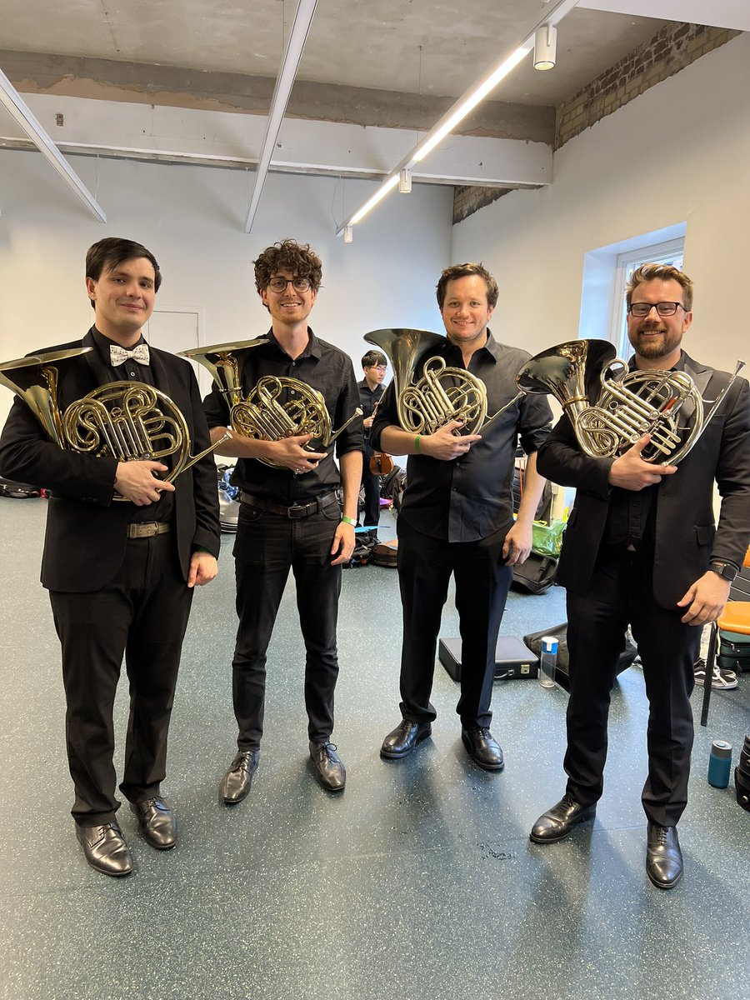
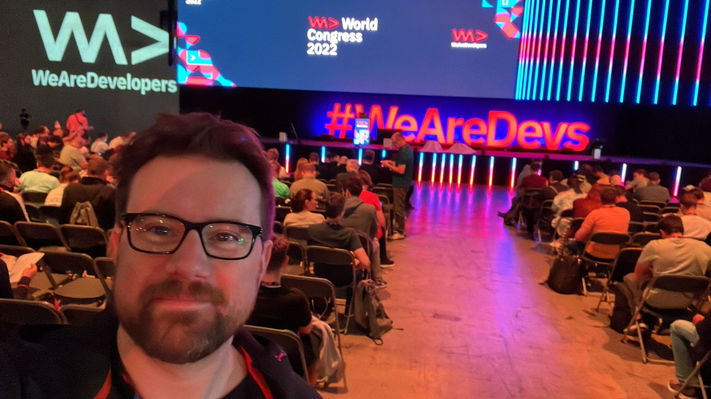
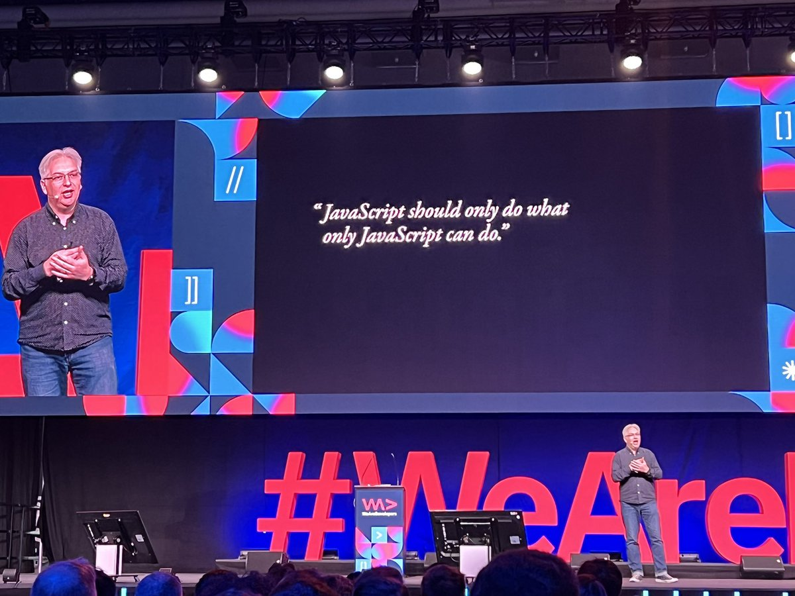
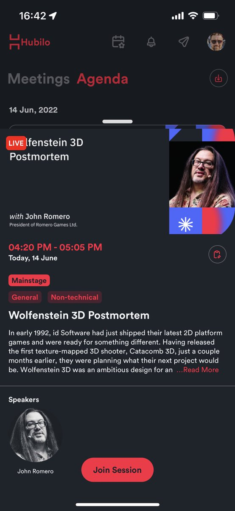
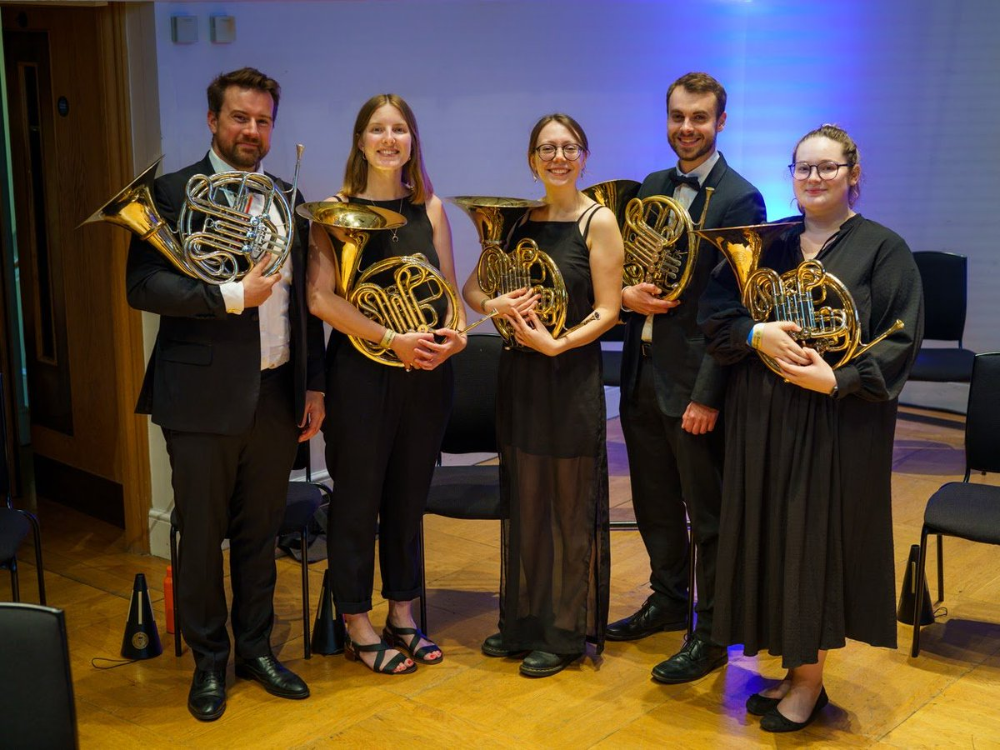
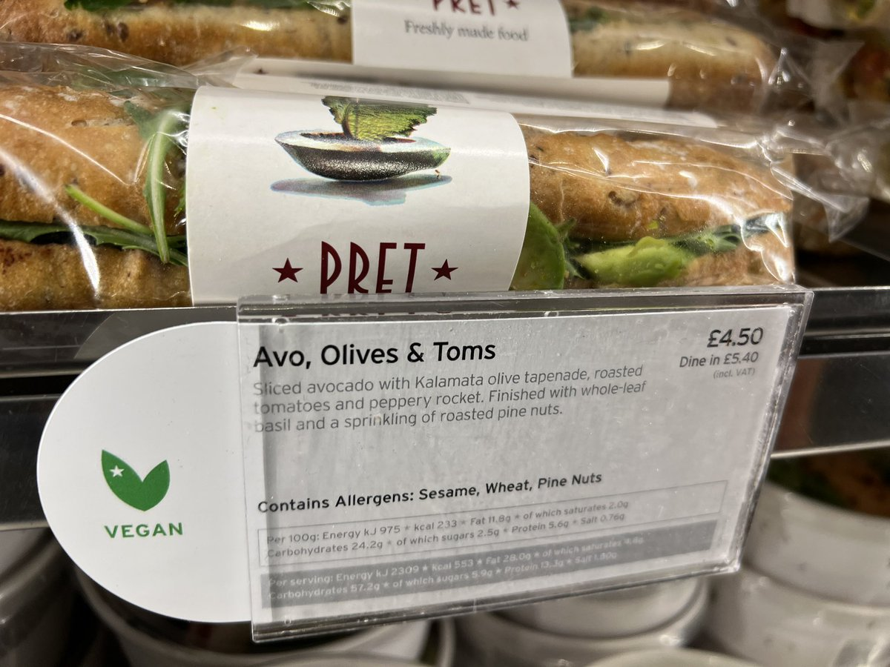
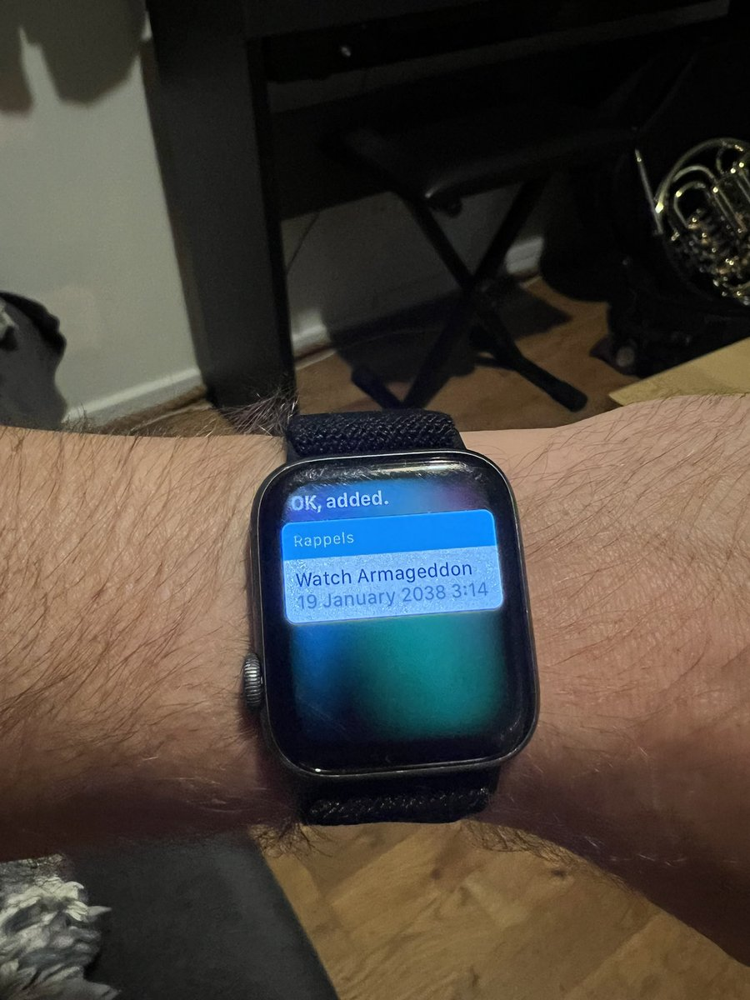
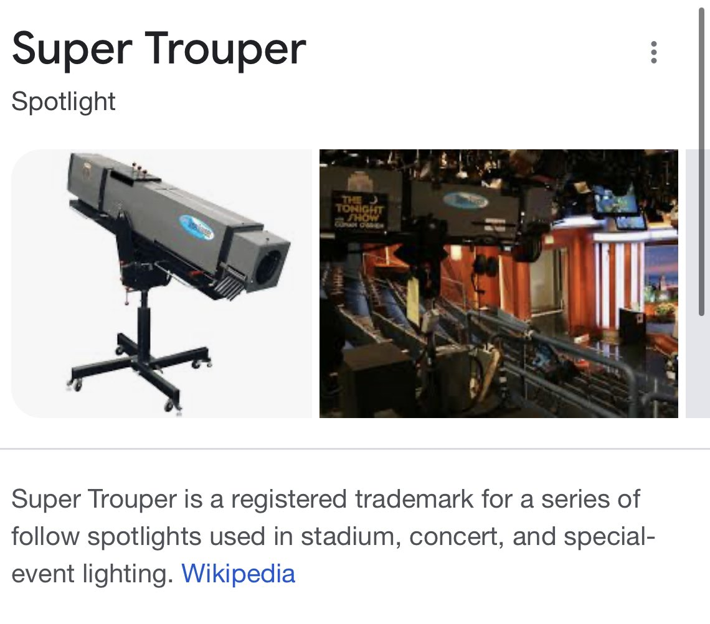
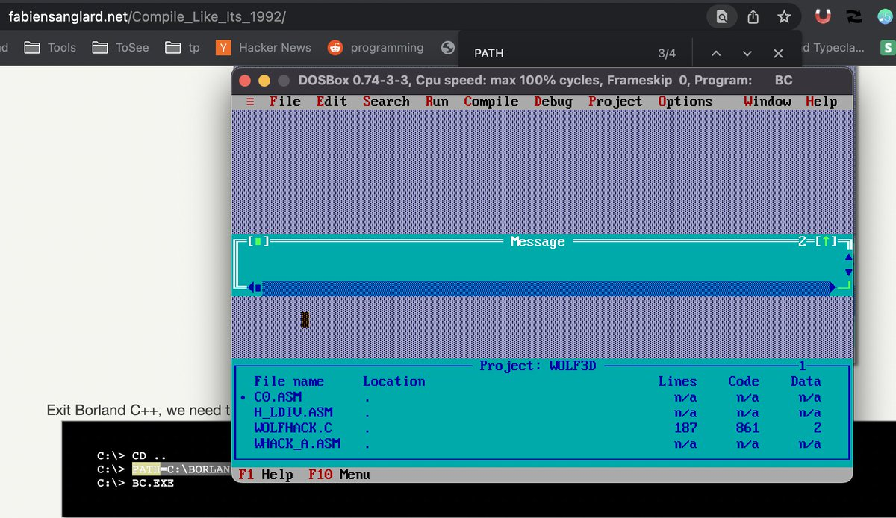

[Wed Jan 12 13:40:29 +0000 2022](https://twitter.com/x4d3/status/1481259793012731919)

RT @aemkei: THE #MATRIX 
An animated quine in only 187 bytes of HTML+JS:

&lt;body onload='setInterval(f=_=&gt;{for(t++,o=i=0,w=35;i&lt;384;o+=i++%+…

----

[Thu Jan 13 13:49:18 +0000 2022](https://twitter.com/x4d3/status/1481624400155889666)

RT @jonty: Biggest news of 2022: http://zombo.com is now HTML5

welcome 

----

[Thu Jan 13 13:49:33 +0000 2022](https://twitter.com/x4d3/status/1481624460692238337)

@louispilfold At last !

----

[Mon Jan 17 06:31:25 +0000 2022](https://twitter.com/x4d3/status/1482963752798539776)

@gloupin https://youtu.be/AbSehcT19u0

----

[Mon Jan 17 10:28:16 +0000 2022](https://twitter.com/x4d3/status/1483023360007229442)

@FrancoisMassot @fulmicoton @reactjs @Quickwit_Inc Looks like Material UI would be a good fit ? https://mui.com/

----

[Tue Jan 25 10:39:12 +0000 2022](https://twitter.com/x4d3/status/1485925213296635908)

@Blitz_Stream Allez ! Viens sur https://lichess.org/ On est bien bien bien bien bien ! :)

----

[Fri Feb 04 14:33:55 +0000 2022](https://twitter.com/x4d3/status/1489608159891275781)

@airfocus Thanks @bradprtr  for the arrangement :) 

<video controls width="600" height="450">
<source src="media/1489608159891275781-OvHZxnBO6Le9ewAb.mp4">Your browser does not support the video tag: <a href="media/1489608159891275781-OvHZxnBO6Le9ewAb.mp4">media/1489608159891275781-OvHZxnBO6Le9ewAb.mp4</a>
</video>

----

[Fri Feb 04 19:47:15 +0000 2022](https://twitter.com/x4d3/status/1489687012437377028)

@m_ou_se @github If you copy cells from google doc, it format them as a table :) it’s very nice.

----

[Sat Feb 05 16:55:02 +0000 2022](https://twitter.com/x4d3/status/1490006059532099584)

@colourfulchris @ThreatNotation Thanks @bradprtr for the arrangement ! 

<video controls width="600" height="450">
<source src="media/1490006059532099584-rbQIvrd7FchP3Rfp.mp4">Your browser does not support the video tag: <a href="media/1490006059532099584-rbQIvrd7FchP3Rfp.mp4">media/1490006059532099584-rbQIvrd7FchP3Rfp.mp4</a>
</video>

----

[Mon Feb 07 11:52:09 +0000 2022](https://twitter.com/x4d3/status/1490654613128818691)

RT @LondonCityOrch: Come along to Pimlico on Saturday 12th February and hear us play this gorgeous piece as part of our French-themed conce…

----

[Wed Feb 09 09:26:54 +0000 2022](https://twitter.com/x4d3/status/1491342835550883845)

@m_ou_se I love it.
Here's a gist for people that want to play around
https://gist.github.com/x4d3/176d853c201d657f7699f2f2da12f8b3

----

[Fri Feb 11 09:38:44 +0000 2022](https://twitter.com/x4d3/status/1492070589821075457)

@4threset At first, I thought it was a remake of Calvin and Hobbes :) 

----

[Mon Feb 28 17:26:49 +0000 2022](https://twitter.com/x4d3/status/1498348981113470983)

@1Password @phantom @solana Please don't.

https://glyph.twistedmatrix.com/2022/02/legitimizing-blockchain.html

----

[Tue Mar 01 12:24:38 +0000 2022](https://twitter.com/x4d3/status/1498635320975372297)

Please help me fund a full year of Music and Life-Skills Education for girls in Uganda, Rwanda and Liberia.
 https://brassforafrica.enthuse.com/pf/xavier-delamotte/post/1402079

----

[Mon Mar 14 19:34:21 +0000 2022](https://twitter.com/x4d3/status/1503454503756091400)

@maitea6 Malcom in the middle

----

[Mon Mar 21 14:14:07 +0000 2022](https://twitter.com/x4d3/status/1505910629068120069)

The french word "créée" exists, and it's freaking me out every time I see it.

----

[Tue Apr 05 18:13:37 +0000 2022](https://twitter.com/x4d3/status/1511406721314533383)

@Awstein @charlesancelle Mastodon ? https://mastodon.social/

----

[Thu Apr 14 07:54:58 +0000 2022](https://twitter.com/x4d3/status/1514512523382374403)

@HadrienMP Oui, d ailleurs rspec a déprécié le should matcher https://relishapp.com/rspec/rspec-expectations/docs/syntax-configuration

----

[Fri Apr 15 09:46:39 +0000 2022](https://twitter.com/x4d3/status/1514903016826093571)

@FranceintheUK @VirtualityParis @lavalvirtual @parisnft_day @NFTFactoryParis https://www.ladn.eu/tech-a-suivre/le-web3-ils-le-detestent-deja/

----

[Fri Apr 15 13:48:10 +0000 2022](https://twitter.com/x4d3/status/1514963795449458689)

RT @lvgorchestra: CONCERT DATE ANNOUNCEMENT!

Our next concert's venue and date have been set! Come see us play a selection of fantastic vi…

----

[Fri Jun 10 19:49:12 +0000 2022](https://twitter.com/x4d3/status/1535348375511506950)

RT @woolwich_works: Landing at Woolwich Works THIS SATURDAY it's @lvgorchestra!

Featuring music from Halo, Final Fantasy, The Legend of Ze…

----

[Sun Jun 12 11:31:42 +0000 2022](https://twitter.com/x4d3/status/1535947949838147584)

What a pleasure and honour to play with the @lvgorchestra yesterday. It was a blast. 

----

[Tue Jun 14 07:10:38 +0000 2022](https://twitter.com/x4d3/status/1536607027853725697)

Excited to be in Berlin for the #wearedevelopers conference ! 

----

[Tue Jun 14 10:30:42 +0000 2022](https://twitter.com/x4d3/status/1536657372977963009)

Amazing talk from @adactio at #wearedevs about design principles.

https://principles.adactio.com/ 

----

[Tue Jun 14 10:48:20 +0000 2022](https://twitter.com/x4d3/status/1536661810547503105)

https://youtu.be/FLKxn321FiE

----

[Tue Jun 14 13:44:53 +0000 2022](https://twitter.com/x4d3/status/1536706243267645441)

@arnauddelafosse Haha, if only I could update tweet. Thanks for adding the timestamp.

----

[Tue Jun 14 14:51:36 +0000 2022](https://twitter.com/x4d3/status/1536723032345128960)

Fanboying over John @romero at #WeAreDevelopers2022 
doing the post mortel of Wolfenstein 3D. This is so cool! 

----

[Sat Jun 18 12:30:29 +0000 2022](https://twitter.com/x4d3/status/1538137069113028608)

RT @LondonCityOrch: It's a month today! Have you got your ticket yet? Make sure you grab your place to hear this amazing programme @cadogan…

----

[Tue Jul 05 09:46:25 +0000 2022](https://twitter.com/x4d3/status/1544256374086983682)

https://www.quantamagazine.org/hugo-duminil-copin-wins-the-fields-medal-20220705/

----

[Tue Jul 05 12:56:05 +0000 2022](https://twitter.com/x4d3/status/1544304106524868609)

https://www.youtube.com/watch?v=AY_B9gk18Mw

----

[Thu Jul 07 17:13:32 +0000 2022](https://twitter.com/x4d3/status/1545093671053393922)

RT @thegautamkamath: 🧵Fields medalist June Huh shares an early math experience: a chess puzzle in the game "The 11th Hour." Story and figur…

----

[Wed Jul 13 07:56:22 +0000 2022](https://twitter.com/x4d3/status/1547127783180099585)

RT @NadinBenjamin: So excited to perform the  magical four last songs on Friday 15 July at 7:30pm in ⁦@cadoganhall⁩ with ⁦@LondonCityOrch⁩…

----

[Wed Jul 13 08:13:22 +0000 2022](https://twitter.com/x4d3/status/1547132062662070275)

@Blitz_Stream 

<video controls width="600" height="450">
<source src="media/1547132062662070275-FXiEY83XgAEXzIn.mp4">Your browser does not support the video tag: <a href="media/1547132062662070275-FXiEY83XgAEXzIn.mp4">media/1547132062662070275-FXiEY83XgAEXzIn.mp4</a>
</video>

----

[Thu Jul 14 17:18:33 +0000 2022](https://twitter.com/x4d3/status/1547631649159929858)

RT @LondonCityOrch: We'd love to see you in person at @cadoganhall tomorrow for our season finale with @nadinbenjamin. But if you can't mak…

----

[Thu Jul 14 19:18:28 +0000 2022](https://twitter.com/x4d3/status/1547661825801535494)

@louispilfold World of illusion, Lion King and Aladdin on genesis mega drive
Megaman 1 and 2, Chip and Dale and Duck Tales on Nes

----

[Thu Jul 14 19:55:58 +0000 2022](https://twitter.com/x4d3/status/1547671264688410628)

🤯 https://codegolf.stackexchange.com/questions/215216/high-throughput-fizz-buzz/236630#236630

----

[Tue Jul 19 08:45:37 +0000 2022](https://twitter.com/x4d3/status/1549314504026165248)

Very proud to have played with the @LondonCityOrch  at @cadoganhall last Friday. Such an amazing experience. 

----

[Thu Aug 25 07:13:27 +0000 2022](https://twitter.com/x4d3/status/1562699662259535872)

@gloupin 

<video controls width="600" height="450">
<source src="media/1562699662259535872-Fa_TDgFagAQsJ2O.mp4">Your browser does not support the video tag: <a href="media/1562699662259535872-Fa_TDgFagAQsJ2O.mp4">media/1562699662259535872-Fa_TDgFagAQsJ2O.mp4</a>
</video>

----

[Fri Sep 02 15:46:04 +0000 2022](https://twitter.com/x4d3/status/1565727769866244103)

Ils sont toujours en forme ! 

----

[Thu Sep 08 12:05:15 +0000 2022](https://twitter.com/x4d3/status/1567846523605499904)

@nisslbodies Yeah but only thanks to the “once” tv show. :) 

<video controls width="600" height="450">
<source src="media/1567846523605499904-FcIcGbwWAAAwMUo.mp4">Your browser does not support the video tag: <a href="media/1567846523605499904-FcIcGbwWAAAwMUo.mp4">media/1567846523605499904-FcIcGbwWAAAwMUo.mp4</a>
</video>

----

[Fri Sep 09 11:33:07 +0000 2022](https://twitter.com/x4d3/status/1568200828522987524)

https://x4d3.github.io/trois-petits-chats/

----

[Wed Sep 14 07:33:20 +0000 2022](https://twitter.com/x4d3/status/1569952422264438784)

This is an amazing read. https://twitter.com/tobi/status/1359854696257757184

----

[Sat Sep 17 22:37:32 +0000 2022](https://twitter.com/x4d3/status/1571267134252060672)

Tried to add myself a reminder for in 20 years, and encountered the year 2038 bug :) https://en.wikipedia.org/wiki/Year_2038_problem 

----

[Sun Sep 18 12:20:04 +0000 2022](https://twitter.com/x4d3/status/1571474133145329667)

I was today years old when I’ve learned what is the Super Trouper in the #ABBA  song. 

----

[Wed Sep 21 21:31:32 +0000 2022](https://twitter.com/x4d3/status/1572700077977923584)

@smlpth 

----

[Mon Sep 26 05:44:57 +0000 2022](https://twitter.com/x4d3/status/1574273801621147649)

RT @fabynou: I am releasing today the "Book of CP-System" about the machine running early 90s arcade hits like Street Fighter II, Final Fig…

----

[Sat Oct 01 20:01:23 +0000 2022](https://twitter.com/x4d3/status/1576301268343349248)

RT @tobi: Most things worth learning have steep but reasonable learning curves. Crazy learning curve stuff is usually also not worth it. I…

----

[Mon Oct 03 19:00:54 +0000 2022](https://twitter.com/x4d3/status/1577010821808345093)

RT @kddnewton: Someone pointed me to latexify today, a python package that converts python code into equivalent LaTeX markup. (https://t.co…

----

[Mon Oct 10 11:39:56 +0000 2022](https://twitter.com/x4d3/status/1579436568041119746)

@Ethenyl @smlpth @swatiswoboda Love this !

----

[Mon Oct 10 21:28:46 +0000 2022](https://twitter.com/x4d3/status/1579584750930767874)

@octplane There is also Simple CSS which I found quite nice.

https://simplecss.org/

----

[Sun Oct 16 09:47:09 +0000 2022](https://twitter.com/x4d3/status/1581582510882160640)

Having fun "compiling like it's 1992" Wolfenstein 3D thanks to @fabynou great article.

https://fabiensanglard.net/Compile_Like_Its_1992/ 

----

[Mon Oct 24 06:50:47 +0000 2022](https://twitter.com/x4d3/status/1584437230541471744)

@gloupin @Jehane_fr 

<video controls width="600" height="450">
<source src="media/1584437230541471744-Ff0NQXXX0AIXjoo.mp4">Your browser does not support the video tag: <a href="media/1584437230541471744-Ff0NQXXX0AIXjoo.mp4">media/1584437230541471744-Ff0NQXXX0AIXjoo.mp4</a>
</video>

----

[Sat Oct 29 08:00:06 +0000 2022](https://twitter.com/x4d3/status/1586266612612878337)

RT @lichess: In https://lichess.org/blog/Y1wpBhEAAB8AwbeG/taking-lichess-to-the-next-level we want to dive deeper into Lichess’s history, how we’re currently set up, and our plans for the fu…

----

[Mon Oct 31 07:24:03 +0000 2022](https://twitter.com/x4d3/status/1586982316173393920)

My mastodon profile: https://mamot.fr/web/@xade#